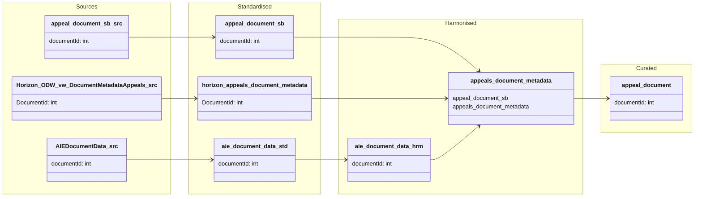

#### ODW Data Model

##### entity: aie-document-data

Data model for AIE (Automated Information Exchange) document data entity showing data flow from source to harmonised.

**Note:** AIE document data contains document metadata extracted from the Horizon DocumentTree system, including file information, versioning, publishing status, and document classifications for appeals and examinations.

### Data Flow Summary

#### Horizon DocumentTree-based AIE Document Data

1. **Source → Raw**: Document metadata from Horizon DocumentTree system is extracted
   - Data stored as CSV files in `abfss://odw-raw@{storage}/AIEDocumentData/YYYY-MM-DD/extract_file.csv`
   - Contains comprehensive document metadata including file properties, versioning, and status information
   - Source system identified as "DocumentTree" in `main_sourcesystem_fact`

2. **Raw → Standardised**: `py_raw_to_std` notebook processes CSV extracts
   - Reads latest dated folder from AIEDocumentData directory
   - Flattens CSV data to tabular delta format
   - Stores in `odw_standardised_db.aie_document_data` delta table (partitioned by expected_from date)
   - Preserves all 30+ source fields for document tracking

3. **Standardised → Harmonised**: `py_horizon_harmonised_aie_document` notebook implements complex SCD Type 2
   - Uses composite primary key: **DocumentID + Version + Mime**
   - Handles four update scenarios:
     1. Net new records (not in target)
     2. Incorrectly inactivated records (IsActive='N' but should be 'Y')
     3. New versions of existing documents
     4. Records to be inactivated (no longer in source)
   - Calculates MD5 hash across all 30+ fields for change detection
   - Manages temporal validity using `IngestionDate` and `ValidTo` timestamps
   - Assigns surrogate key `AIEDocumentDataID` using ROW_NUMBER()
   - Stores in `odw_harmonised_db.aie_document_data` delta table (partitioned)

4. **No Curated Layer**: AIE document data remains in harmonised only
   - Consumed directly by downstream entities like `appeals_document_metadata`
   - Used for enriching document information in appeals and NSIP workflows

#### Integration with Other Entities

The AIE document data entity serves as a document metadata repository for:
- **appeals_document_metadata**: Joins via `documentId` to enrich document metadata with AIE fields (mime, documentURI, fileMD5, owner)
- **NSIP document workflows**: Via `py_sb_horizon_harmonised_nsip_document` notebook
-  **Appeal document workflows**: Via `py_sb_horizon_harmonised_appeal_document` notebook
- **Document quality tests**: `py_unit_tests_nsip_document` and `py_unit_tests_appeal_document` validate data integrity

#### Pipelines and Notebooks

**Pipelines:**
- `AIEData`: Source to raw data copy pipeline
- `pln_aie_document_data`: Main orchestration (Raw → Standardised → Harmonised)
- `rel_1374_aie`: Release-specific pipeline
- `pln_document_metadata_main`: Main document metadata orchestration including AIE
- `pln_appeals_document_main`: Appeals document pipeline including AIE
- `pln_horizon`: Horizon data pipeline including AIE

**Notebooks:**
- `py_raw_to_std`: Ingests raw CSV to standardised delta table (with source_folder='AIEDocumentData')
- `py_horizon_harmonised_aie_document`: Implements SCD Type 2 for harmonised layer
- `appeals_document_metadata`: Consumes AIE data for document enrichment
- `py_sb_horizon_harmonised_nsip_document`: Uses AIE data for NSIP documents
- `py_sb_horizon_harmonised_appeal_document`: Uses AIE data for appeal documents
- `py_unit_tests_nsip_document`: Data quality tests for NSIP+AIE
- `py_unit_tests_appeal_document`: Data quality tests for appeals+AIE

**Key Tables:**
- **Standardised**: `odw_standardised_db.aie_document_data` (delta, partitioned)
  - Location: `abfss://odw-standardised@{storage}/AIEDocumentData/aie_document_data`
- **Harmonised**: `odw_harmonised_db.aie_document_data` (delta, partitioned)
  - Location: `abfss://odw-harmonised@{storage}/odw_harmonised_db.aie_document_data`

#### Data Characteristics

- **Update Frequency**: Periodic extracts from Horizon DocumentTree (dated snapshots)
- **Composite Primary Key**: DocumentID + Version + Mime (natural key)
- **Surrogate Key**: `AIEDocumentDataID` (auto-generated via ROW_NUMBER)
- **Business Purpose**: Track document versions, publishing status, metadata, and file properties
- **Temporal Pattern**: SCD Type 2 with complex update handling for versioned documents
- **Source System**: Horizon DocumentTree
- **Source System ID**: Links to "DocumentTree" in `main_sourcesystem_fact`
- **Data Volume**: High-volume document metadata covering appeals and examinations

#### Key Fields Description

**Document Identifiers:**
- `DocumentID`: Unique document identifier from Horizon
- `Version`: Document version number (supports versioning)
- `Mime`: MIME type of the document file

**File Properties:**
- `FileName`, `OriginalFileName`: Current and original file names
- `Size`: File size
- `FileMD5`: MD5 hash for integrity verification
- `DocumentURI`, `Path`: Storage location information
- `VirusCheckStatus`: Security scan status

**Document Metadata:**
- `CaseReference`: Related case reference number
- `DocumentReference`: Document-specific reference
- `ExaminationRefNo`: Examination reference (for NSIP cases)
- `DocumentType`: Type classification
- `DocumentStatus`: Current status (e.g., draft, final)
- `PublishedStatus`: Publication state
- `RedactedStatus`: Redaction state

**Classification & Security:**
- `SecurityClassification`: Security level
- `CaseType`: Type of case (appeal/examination)
- `Stage`: Process stage
- `Filter1`, `Filter2`: Additional classification filters

**Content & Ownership:**
- `Description`: Document description
- `Owner`, `Author`, `Representative`: Ownership and authorship information
- `Origin`, `SourceSystem`: Origin tracking

**Temporal Fields:**
- `DateCreated`, `LastModified`, `DatePublished`: Timestamp tracking
- `IngestionDate`: When record entered harmonised
- `ValidTo`: SCD Type 2 validity end date
