#### ODW Data Model

##### entity: appeal-document

Data model for appeal-document entity showing data flow from source to curated.

```mermaid
classDiagram

    direction LR

    namespace Sources {

        class appeal_document_sb_src {
            documentId
        }

        class Horizon_ODW_vw_DocumentMetadataAppeals_src {
            documentId
        }

        class AIEDocumentData_src {
            documentId
        }
    }

    namespace Raw {

        class appeal_document_sb_raw {
            odw-raw/ServiceBus/appeal-document/appeal-document_YYYY-MM-DDTHH_MM_SS.ffffff+0000.json
        }

        class HorizonAppealsDocumentMetadata.csv {
            documentId
        }

        class AIEDocumentData_raw {
            odw-raw/AIEDocumentData/
        }
    }

    namespace Standardised {

        class sb_appeal_document {
            documentId
        }

        class horizon_appeals_document_metadata {
            documentId
        }

        class aie_document_data_std {
            documentId
        }
    }

    namespace Harmonised {

        class sb_appeal_document_hrm {
            documentId
        }

        class aie_document_data_hrm {
            documentId
        }

        class appeal_document_hrm {

            TEMP_PK
            documentId
            filename
            version
            documentURI

        }
    }

    namespace Curated {

        class appeal_document {
            documentId
        }
    }

    appeal_document_sb_src --> appeal_document_sb_raw
    appeal_document_sb_raw --> sb_appeal_document
    sb_appeal_document --> sb_appeal_document_hrm

    Horizon_ODW_vw_DocumentMetadataAppeals_src --> HorizonAppealsDocumentMetadata.csv
    HorizonAppealsDocumentMetadata.csv --> horizon_appeals_document_metadata
    AIEDocumentData_src --> AIEDocumentData_raw
    AIEDocumentData_raw --> aie_document_data_std
    aie_document_data_std --> aie_document_data_hrm

    sb_appeal_document_hrm --> appeal_document_hrm
    horizon_appeals_document_metadata --> appeal_document_hrm
    aie_document_data_hrm --> appeal_document_hrm

    appeal_document_hrm --> appeal_document
```

### Tables and views

- Raw (Azure Data Lake odw-raw)
  - odw-raw/ServiceBus/appeal-document/ (service bus messages landed by function app)
  - odw-raw/Horizon/HorizonAppealsDocumentMetadata.csv (Horizon appeals document metadata extract)
  - odw-raw/AIEDocumentData/ (AIE CSV extract)

- Standardised
  - odw_standardised_db.sb_appeal_document (service bus messages)
  - odw_standardised_db.horizon_appeals_document_metadata (Horizon appeals document metadata)
  - odw_standardised_db.aie_document_data (AIE document extracts)

- Harmonised
  - odw_harmonised_db.sb_appeal_document (service bus staging table — output of py_sb_std_to_hrm)
  - odw_harmonised_db.aie_document_data (harmonised AIE document data — output of py_horizon_harmonised_aie_document)
  - odw_harmonised_db.appeal_document (merged harmonised table combining Service Bus, Horizon and AIE data)

- Curated
  - odw_curated_db.appeal_document (external curated table)

- MiPINS
  - No MiPINS curated step identified for this entity

- Views
  - None identified

### Orchestration and lineage

- Pipelines
  - workspace/pipeline/pln_service_bus_appeals_document.json
    - Src to Raw: pln_trigger_function_app (reads Service Bus messages → odw-raw/ServiceBus/appeal-document/)
    - Raw to Std: py_sb_raw_to_std → odw_standardised_db.sb_appeal_document
    - Std to Hrm: py_sb_std_to_hrm → odw_harmonised_db.sb_appeal_document

  - workspace/pipeline/pln_horizon_appeals_document_metadata.json
    - Src to Raw: 0_Raw_Horizon_Appeals_Document_Metadata (Horizon DB → odw-raw/Horizon/HorizonAppealsDocumentMetadata.csv)
    - Raw to Std: py_raw_to_std → odw_standardised_db.horizon_appeals_document_metadata

  - workspace/pipeline/pln_aie_document_data.json
    - Src to Raw: AIEData pipeline → odw-raw/AIEDocumentData/
    - Raw to Std: py_raw_to_std → odw_standardised_db.aie_document_data
    - Std to Hrm: py_horizon_harmonised_aie_document → odw_harmonised_db.aie_document_data

  - workspace/pipeline/pln_appeals_document_main.json
    - Runs:
      - pln_service_bus_appeals_document
      - pln_horizon_appeals_document_metadata
      - pln_aie_document_data
    - Curated step:
      - appeal_document notebook → odw_curated_db.appeal_document

- Notebooks
  - workspace/notebook/py_sb_horizon_harmonised_appeal_document.json
    - Reads:
      - odw_harmonised_db.sb_appeal_document
      - odw_standardised_db.horizon_appeals_document_metadata
      - odw_harmonised_db.aie_document_data
    - Writes:
      - odw_harmonised_db.appeal_document

  - workspace/notebook/appeal_document.json
    - Reads:
      - odw_harmonised_db.appeal_document
    - Writes:
      - odw_curated_db.appeal_document

  - workspace/notebook/py_horizon_harmonised_aie_document.json
    - Reads:
      - odw_standardised_db.aie_document_data
    - Writes:
      - odw_harmonised_db.aie_document_data

### Findings

- Service Bus, Horizon and AIE data are merged into a single harmonised table:
  - odw_harmonised_db.appeal_document

- The harmonisation process is implemented in:
  - py_sb_horizon_harmonised_appeal_document

- Horizon records are enriched using AIE document metadata before being written to the harmonised layer.

- The curated appeal_document dataset is sourced from:
  - odw_harmonised_db.appeal_document

- No transformation dependency entry for appeal-document was identified in orchestration_transform_dependencies.yaml. The lineage was derived from orchestration configuration, pipelines and notebook implementations.
