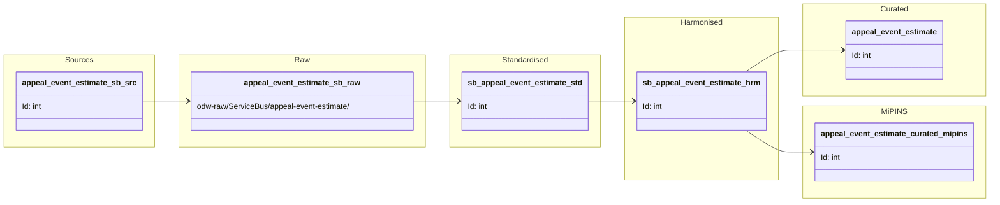

#### ODW Data Model
 
##### entity: appeal-event-estimate
 
Data model for appeal-event-estimate entity showing data flow from source to curated.
 

### Tables and views

- Raw (Azure Data Lake odw-raw)
  - odw-raw/ServiceBus/appeal-event-estimate/ (service bus messages landed in the raw layer)

- Standardised
  - odw_standardised_db.sb_appeal_event_estimate

- Harmonised
  - odw_harmonised_db.sb_appeal_event_estimate

- Curated
  - odw_curated_db.appeal_event_estimate

- MiPINS
  - odw_curated_db.appeal_event_estimate_curated_mipins

- Views
  - odw_curated_db.vw_appeal_event_estimate_curated_mipins

### Orchestration and lineage

- Pipelines

  - workspace/pipeline/pln_entity_appeal_event_estimate.json
    - Executes:
      - appeal_event_estimate notebook

  - workspace/pipeline/pln_copy_appeal_event_estimate_curated_mipins.json
    - Copies appeal_event_estimate_curated_mipins dataset to MiPINS SQL destination

- Notebooks

  - workspace/notebook/appeal_event_estimate.json
    - Reads:
      - odw_harmonised_db.sb_appeal_event_estimate
    - Filters:
      - IsActive = 'Y'
    - Writes:
      - odw_curated_db.appeal_event_estimate

  - workspace/notebook/appeal_event_estimate_curated_mipins.json
    - Reads:
      - odw_harmonised_db.sb_appeal_event_estimate
    - Creates view:
      - odw_curated_db.vw_appeal_event_estimate_curated_mipins
    - Writes:
      - odw_curated_db.appeal_event_estimate_curated_mipins
