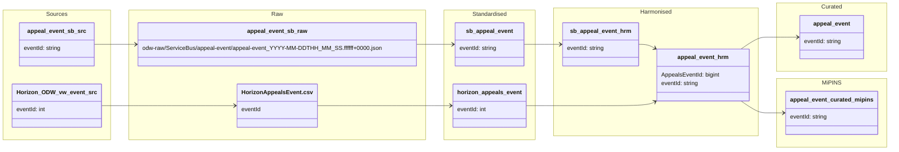

#### ODW Data Model

##### entity: appeal-event

Data model for appeal-event entity showing data flow from source to curated.

### Tables and views

- Raw (Azure Data Lake odw-raw)
  - odw-raw/ServiceBus/appeal-event/ (service bus messages landed by function app)
  - odw-raw/Horizon/HorizonAppealsEvent.csv (Horizon appeals event extract)

- Standardised
  - odw_standardised_db.sb_appeal_event (service bus messages)
  - odw_standardised_db.horizon_appeals_event (Horizon appeals event data)

- Harmonised
  - odw_harmonised_db.sb_appeal_event (service bus staging table — output of py_sb_std_to_hrm)
  - odw_harmonised_db.appeal_event (merged harmonised table combining Service Bus and Horizon event data)

- Curated
  - odw_curated_db.appeal_event (external curated table)

- MiPINS
  - odw_curated_db.appeal_event_curated_mipins (MiPINS export table)

- Views
  - None identified

### Orchestration and lineage

- Pipelines

  - workspace/pipeline/pln_service_bus_appeals_event.json
    - Src to Raw: pln_trigger_function_app (reads Service Bus messages → odw-raw/ServiceBus/appeal-event/)
    - Raw to Std: py_sb_raw_to_std → odw_standardised_db.sb_appeal_event
    - Std to Hrm: py_sb_std_to_hrm → odw_harmonised_db.sb_appeal_event

  - workspace/pipeline/pln_horizon_Appeals_Event.json
    - Src to Raw: 0_Raw_Horizon_Appeals_Event_copy1 (Horizon_ODW_vw_event → odw-raw/Horizon/HorizonAppealsEvent.csv)
    - Raw to Std: py_raw_to_std → odw_standardised_db.horizon_appeals_event

  - workspace/pipeline/pln_copy_appeal_event_curated_mipins.json
    - Copies curated MiPINS dataset to MiPINS SQL destination

- Notebooks

  - workspace/notebook/py_sb_horizon_harmonised_appeal_event.json
    - Reads:
      - odw_harmonised_db.sb_appeal_event
      - odw_standardised_db.horizon_appeals_event
    - Writes:
      - odw_harmonised_db.appeal_event

  - workspace/notebook/appeal_event.json
    - Reads:
      - odw_harmonised_db.appeal_event
    - Filters:
      - IsActive = 'Y'
    - Writes:
      - odw_curated_db.appeal_event

  - workspace/notebook/appeal_event_curated_mipins.json
    - Reads:
      - odw_harmonised_db.appeal_event
    - Writes:
      - odw_curated_db.appeal_event_curated_mipins

  - workspace/notebook/horizon_appeal_event_harmonised.json
    - Reads:
      - odw_standardised_db.horizon_appeals_event
      - odw_harmonised_db.sb_appeal_event
    - Updates:
      - odw_harmonised_db.sb_appeal_event

