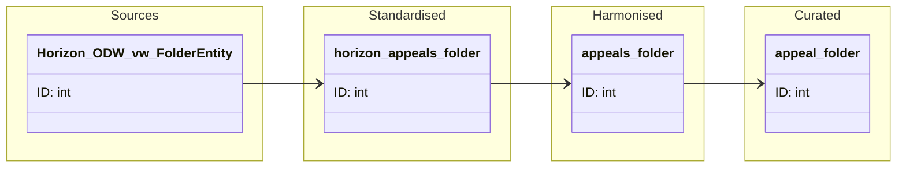

#### ODW Data Model

##### entity: appeal-folder

Data model for appeal-folder entity showing data flow from source to curated.

```mermaid

classDiagram

    direction LR

    namespace Sources {

        class Horizon_ODW_vw_FolderEntity {
            ID: int
        }
    }

    namespace Standardised {

        class horizon_appeals_folder {
            ID: int
        }
    }

    namespace Harmonised {

        class appeals_folder {
            ID: int
        }
    }

    namespace Curated {

        class appeal_folder {
            ID: int
        }
    }

Horizon_ODW_vw_FolderEntity --> horizon_appeals_folder

horizon_appeals_folder --> appeals_folder

appeals_folder --> appeal_folder

```
