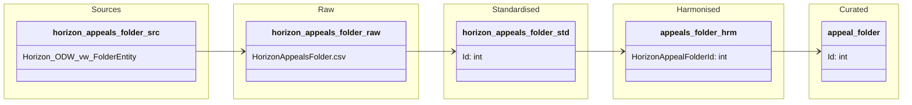

#### ODW Data Model

##### entity: appeal-folder

Data model for appeal-folder entity showing data flow from source to curated.

### Tables and views

- Raw
  - odw-raw/Horizon/HorizonAppealsFolder.csv

- Standardised
  - odw_standardised_db.horizon_appeals_folder

- Harmonised
  - odw_harmonised_db.appeals_folder

- Curated
  - odw_curated_db.appeal_folder

- Views
  - odw_curated_db.vw_appeal_folder

### Orchestration and lineage

- Pipelines
  - 0_Raw_Horizon_Appeals_Folder
  - pln_horizon_appeals_folder
  - pln_curated

- Notebooks
  - appeals_folder
  - appeals_folder_curated

