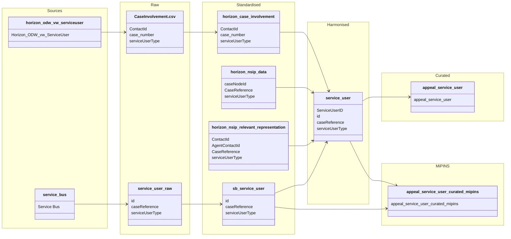

#### ODW Data Model

##### entity: appeal-service-user

Data model for appeal-service-user entity showing data flow from source to curated.

### Tables and views

- Raw
  - odw-raw/Horizon/CaseInvolvement.csv
  - odw-raw/ServiceBus/service-user

- Standardised
  - odw_standardised_db.horizon_case_involvement
  - odw_standardised_db.horizon_nsip_data
  - odw_standardised_db.horizon_nsip_relevant_representation
  - odw_standardised_db.sb_service_user

- Harmonised
  - odw_harmonised_db.service_user

- Curated
  - odw_curated_db.appeal_service_user

- MiPINS
  - odw_curated_db.appeal_service_user_curated_mipins

### Orchestration and lineage

- Pipelines
  - 0_Horizon_Case_Involvement
  - pln_horizon_case_involvement
  - pln_service_bus_service_user
  - pln_service_user_main
  - pln_curated
  - pln_copy_appeal_service_user_curated_mipins

- Notebooks
  - py_sb_horizon_harmonised_service_user
  - appeal_service_user
  - appeal_service_user_curated_mipins

