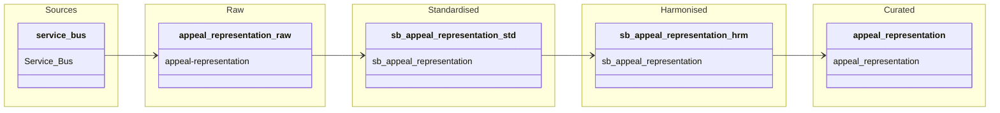

#### ODW Data Model
 
##### entity: appeals-representation
 
Data model for appeals-representation entity showing data flow from source to curated.
 

### Tables and views

- Raw
  - odw-raw/ServiceBus/appeal-representation

- Standardised
  - odw_standardised_db.sb_appeal_representation

- Harmonised
  - odw_harmonised_db.sb_appeal_representation

- Curated
  - odw_curated_db.appeal_representation
 
### Orchestration and lineage

- Pipelines
  - pln_curated

- Notebooks
  - py_sb_std_to_hrm
  - appeal_representation
