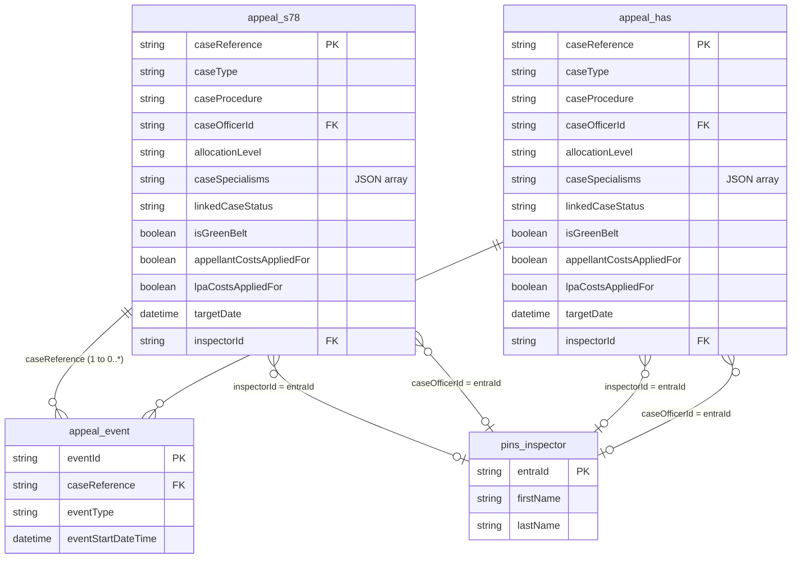
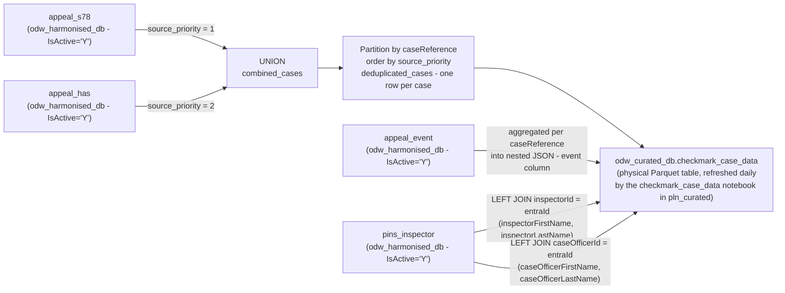
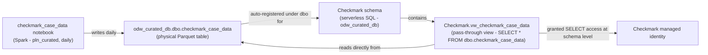

#### ODW Curated Data Model

##### Table: checkmark_case_data (Checkmark Integration)

Logical data model showing the harmonised layer entities that feed `odw_curated_db.checkmark_case_data` and the relationships between them.

---

#### Primary Identifiers and Join Keys

| Entity | Primary Key | Foreign Keys | Source database |
|---|---|---|---|
| `appeal_s78` | `caseReference` | `inspectorId` → `pins_inspector.entraId`; `caseOfficerId` → `pins_inspector.entraId` | `odw_harmonised_db` |
| `appeal_has` | `caseReference` | `inspectorId` → `pins_inspector.entraId`; `caseOfficerId` → `pins_inspector.entraId` | `odw_harmonised_db` |
| `appeal_event` | `eventId` | `caseReference` → `appeal_s78.caseReference` / `appeal_has.caseReference` | `odw_harmonised_db` |
| `pins_inspector` | `entraId` | - | `odw_harmonised_db` |

#### Cardinality

| Relationship | Cardinality | Join condition |
|---|---|---|
| `appeal_s78` → `appeal_event` | One to zero-or-many | `appeal_s78.caseReference = appeal_event.caseReference` |
| `appeal_has` → `appeal_event` | One to zero-or-many | `appeal_has.caseReference = appeal_event.caseReference` |
| `appeal_s78` → `pins_inspector` (inspector) | Many-to-zero-or-one | `appeal_s78.inspectorId = pins_inspector.entraId` |
| `appeal_s78` → `pins_inspector` (case officer) | Many-to-zero-or-one | `appeal_s78.caseOfficerId = pins_inspector.entraId` |
| `appeal_has` → `pins_inspector` (inspector) | Many-to-zero-or-one | `appeal_has.inspectorId = pins_inspector.entraId` |
| `appeal_has` → `pins_inspector` (case officer) | Many-to-zero-or-one | `appeal_has.caseOfficerId = pins_inspector.entraId` |

---

#### Entity Relationships

---

#### Data Flow - Harmonised to Physical Curated Table

---

#### Output Columns - checkmark_case_data

| Column | Source | Notes |
|---|---|---|
| `caseReference` | `appeal_s78` / `appeal_has` | Primary identifier |
| `caseType` | `appeal_s78` / `appeal_has` | |
| `caseProcedure` | `appeal_s78` / `appeal_has` | |
| `caseOfficerId` | `appeal_s78` / `appeal_has` | FK to `pins_inspector.entraId` |
| `allocationLevel` | `appeal_s78` / `appeal_has` | |
| `caseSpecialisms` | `appeal_s78` / `appeal_has` | JSON string |
| `linkedCaseStatus` | `appeal_s78` / `appeal_has` | |
| `isGreenBelt` | `appeal_s78` / `appeal_has` | |
| `costsAppliedFor` | Derived | `'Yes'` if either `lpaCostsAppliedFor` or `appellantCostsAppliedFor` is true; otherwise `'No'` |
| `targetDate` | `appeal_s78` / `appeal_has` | |
| `inspectorId` | `appeal_s78` / `appeal_has` | FK to `pins_inspector.entraId` |
| `inspectorFirstName` | `pins_inspector` | Joined via `inspectorId = entraId` |
| `inspectorLastName` | `pins_inspector` | Joined via `inspectorId = entraId` |
| `caseOfficerFirstName` | `pins_inspector` | Joined via `caseOfficerId = entraId` |
| `caseOfficerLastName` | `pins_inspector` | Joined via `caseOfficerId = entraId` |
| `event` | `appeal_event` | JSON array of `{eventType, eventStartDateTime}` per case |

---

#### Serverless SQL Access Pattern

`odw_curated_db.checkmark_case_data` is a **physical Parquet table**, written daily by the `checkmark_case_data` notebook (`workspace/notebook/checkmark_case_data.json`) in `pln_curated`. Physical tables written by Spark are automatically registered and queryable through the Serverless SQL endpoint, landing under the default `dbo` schema (`odw_curated_db.dbo.checkmark_case_data`) - this is how Synapse exposes Spark tables to SQL.

Spark itself cannot place a table directly inside a custom SQL schema (it only supports 2-level `database.table` naming), so a **dedicated `Checkmark` schema** and a **thin pass-through view** are created directly in T-SQL to give Checkmark a schema-scoped access point:

**Schema and view creation** - `workspace/sqlscript/create_checkmark_schema_and_view.json`, run manually once per environment against `odw_curated_db` (Built-in / serverless SQL pool):
1. Creates the `Checkmark` schema (if not already present)
2. Creates `Checkmark.vw_checkmark_case_data` as a pass-through view over the physical table (`SELECT * FROM [odw_curated_db].[dbo].[checkmark_case_data]`) - no Spark-only functions are used, since all transformation logic (union, dedup, JSON aggregation, `costsAppliedFor` derivation) already happened when the physical table was written

**Access grant** - tracked separately: the Checkmark managed identity is granted `SELECT` on the `Checkmark` schema (least-privilege - scoped to this schema only, not the whole database). Each environment (DEV/TEST/PRD) has its own distinct managed identity, so the grant is applied once per environment.

**Consumption**: Checkmark connects to the Serverless SQL endpoint and queries `Checkmark.vw_checkmark_case_data`.

