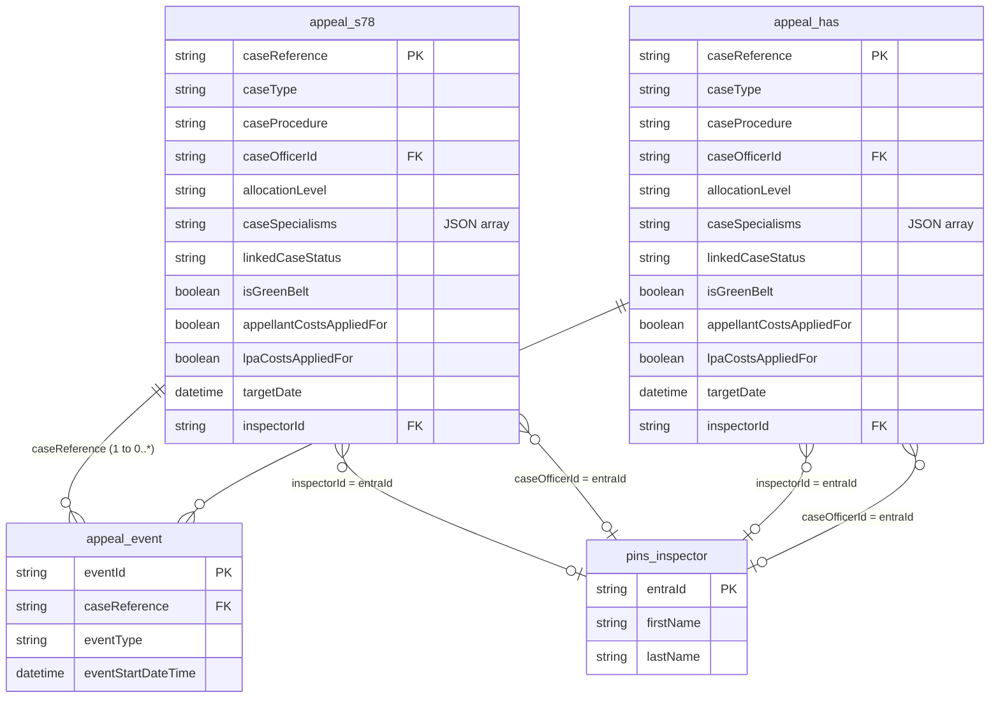
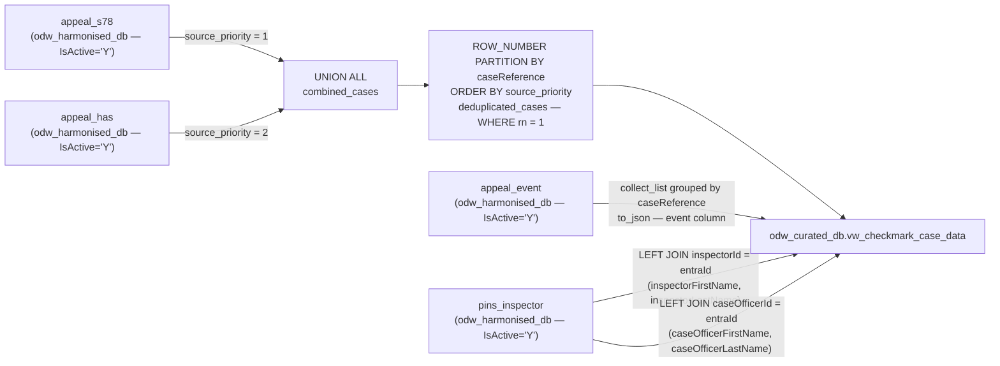

#### ODW Curated Data Model

##### View: vw_checkmark_case_data (Checkmark Integration)

Logical data model showing the harmonised layer entities that feed `odw_curated_db.vw_checkmark_case_data` and the relationships between them.

---

#### Primary Identifiers and Join Keys

| Entity | Primary Key | Foreign Keys | Source database |
|---|---|---|---|
| `appeal_s78` | `caseReference` | `inspectorId` → `pins_inspector.entraId`; `caseOfficerId` → `pins_inspector.entraId` | `odw_harmonised_db` |
| `appeal_has` | `caseReference` | `inspectorId` → `pins_inspector.entraId`; `caseOfficerId` → `pins_inspector.entraId` | `odw_harmonised_db` |
| `appeal_event` | `eventId` | `caseReference` → `appeal_s78.caseReference` / `appeal_has.caseReference` | `odw_harmonised_db` |
| `pins_inspector` | `entraId` | — | `odw_harmonised_db` |

#### Cardinality

| Relationship | Cardinality | Join condition |
|---|---|---|
| `appeal_s78` → `appeal_event` | One to zero-or-many | `appeal_s78.caseReference = appeal_event.caseReference` |
| `appeal_has` → `appeal_event` | One to zero-or-many | `appeal_has.caseReference = appeal_event.caseReference` |
| `appeal_s78` → `pins_inspector` (inspector) | Many-to-zero-or-one | `appeal_s78.inspectorId = pins_inspector.entraId` |
| `appeal_s78` → `pins_inspector` (case officer) | Many-to-zero-or-one | `appeal_s78.caseOfficerId = pins_inspector.entraId` |
| `appeal_has` → `pins_inspector` (inspector) | Many-to-zero-or-one | `appeal_has.inspectorId = pins_inspector.entraId` |
| `appeal_has` → `pins_inspector` (case officer) | Many-to-zero-or-one | `appeal_has.caseOfficerId = pins_inspector.entraId` |

---

#### Entity Relationships

---

#### View Data Flow

---

#### Output Columns — vw_checkmark_case_data

| Column | Source | Notes |
|---|---|---|
| `caseReference` | `appeal_s78` / `appeal_has` | Primary identifier |
| `caseType` | `appeal_s78` / `appeal_has` | |
| `caseProcedure` | `appeal_s78` / `appeal_has` | |
| `caseOfficerId` | `appeal_s78` / `appeal_has` | FK to `pins_inspector.entraId` |
| `allocationLevel` | `appeal_s78` / `appeal_has` | |
| `caseSpecialisms` | `appeal_s78` / `appeal_has` | JSON string via `to_json()` |
| `linkedCaseStatus` | `appeal_s78` / `appeal_has` | |
| `isGreenBelt` | `appeal_s78` / `appeal_has` | |
| `costsAppliedFor` | Derived | `'Yes'` if either `lpaCostsAppliedFor = true` or `appellantCostsAppliedFor = true`; otherwise `'No'` |
| `targetDate` | `appeal_s78` / `appeal_has` | |
| `inspectorId` | `appeal_s78` / `appeal_has` | FK to `pins_inspector.entraId` |
| `inspectorFirstName` | `pins_inspector` | Joined via `inspectorId = entraId` |
| `inspectorLastName` | `pins_inspector` | Joined via `inspectorId = entraId` |
| `caseOfficerFirstName` | `pins_inspector` | Joined via `caseOfficerId = entraId` |
| `caseOfficerLastName` | `pins_inspector` | Joined via `caseOfficerId = entraId` |
| `event` | `appeal_event` | JSON array of `{eventType, eventStartDateTime}` per case |
