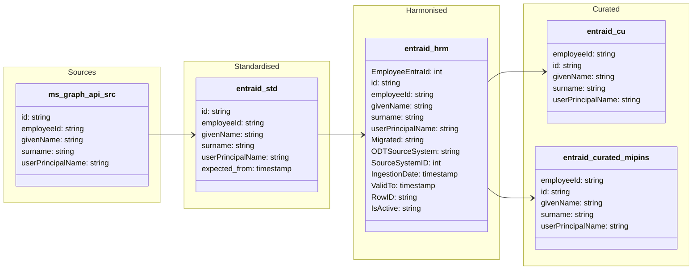

#### ODW Data Model

##### entity: entraid

Data model for EntraID entity showing data flow from source to curated.

**Note:** This diagram shows the Microsoft Graph API-based EntraID entity, which provides identity and user information from Azure Active Directory (Entra ID) for linking with other data entities in the ODW.

---

### Data Flow Summary

#### Microsoft Graph API-based EntraID

1. **Source → Raw**: Microsoft Graph API data is ingested via the `0_Raw_EntraID` pipeline
   - Data is stored as JSON files in `abfss://odw-raw@{storage}/entraid/YYYY-MM-DD/entraid.json`
   - Contains user snapshots from Azure Active Directory (Entra ID)

2. **Raw → Standardised**: `py_raw_to_std` notebook processes the raw JSON
   - Reads the most recent snapshot from the dated folder structure
   - Extracts the `value` attribute containing user array
   - Flattens JSON structure to tabular format
   - Stores in `odw_standardised_db.entraid` delta table
   - Key fields: `id`, `employeeId`, `givenName`, `surname`, `userPrincipalName`

3. **Standardised → Harmonised**: `entraid` notebook implements SCD Type 2 pattern
   - Compares standardised data with existing harmonised records
   - Detects new, updated, and deleted users using MD5 hash comparison
   - Manages temporal validity with `IngestionDate` and `ValidTo` timestamps
   - Maintains active/inactive status with `IsActive` flag ('Y'/'N')
   - Assigns surrogate key `EmployeeEntraId` using ROW_NUMBER()
   - Stores in `odw_harmonised_db.entraid` delta table

4. **Harmonised → Curated**: Two curated outputs
   - **`entraid_cu` notebook**: Creates `odw_curated_db.entraid` parquet table
     - Filters active records (IsActive = 'Y')
     - Selects core identity fields for general consumption
   - **`entraid_curated_mipins` pipeline**: Creates `odw_curated_db.entraid_curated_mipins`
     - Specialized curated view for MIPINS integration

#### Integration with Other Entities

The EntraID entity serves as an identity lookup/mapping table for:
- **pins_inspector**: Links inspector data via `entraid_hrm.id` field
- **appeals_document_metadata**: Joins with AIE document data using EntraID fields
- **dart_api**: Joins on inspector and case officer IDs
- **NSIP documents**: Identity mapping for document ownership

#### Pipelines and Notebooks

**Pipelines:**
- `0_Raw_EntraID`: Extracts data from Microsoft Graph API to raw layer
- `EntraID`: Main orchestration pipeline (Raw → Standardised → Harmonised)
- `pln_copy_entraid_curated_mipins`: Copies data to MIPINS curated layer
- `rel_1403_entraid`: Release-specific pipeline

**Notebooks:**
- `py_raw_to_std`: Ingests raw JSON to standardised delta table
- `entraid`: Implements SCD Type 2 pattern for harmonised layer
- `entraid_cu`: Creates general curated parquet table
- `Entraid_curated_mipins`: Creates MIPINS-specific curated view
- `py_harmonised_pins_inspector`: Consumes EntraID data for inspector entity
- `py_unit_tests_entraid`: Unit tests for EntraID data quality

**Key Tables:**
- **Standardised**: `odw_standardised_db.entraid` (delta)
- **Harmonised**: `odw_harmonised_db.entraid` (delta, SCD Type 2)
- **Curated**: 
  - `odw_curated_db.entraid` (parquet)
  - `odw_curated_db.entraid_curated_mipins` (parquet)

#### Data Characteristics

- **Update Frequency**: Daily snapshots
- **Primary Key**: `id` (EntraID GUID from Azure AD)
- **Business Key**: `employeeId` (SAP employee number)
- **Temporal Pattern**: SCD Type 2 with ValidTo and IsActive flags
- **Source System**: Microsoft Graph API / Azure Active Directory (Entra ID)
- **Source System ID**: Links to SAP HR source system in `main_sourcesystem_fact`
