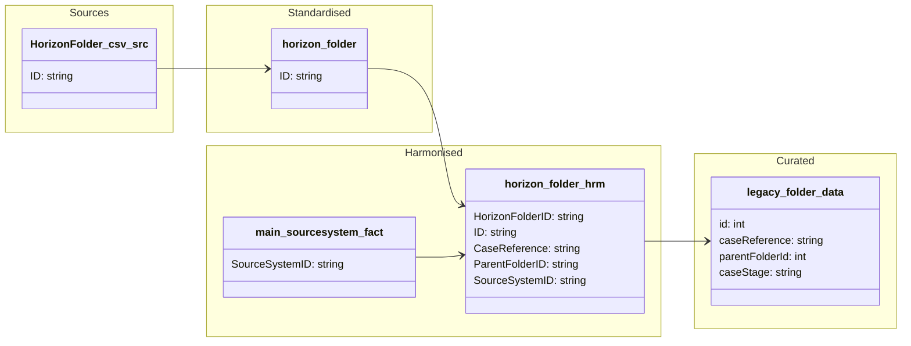

##### ODW Data Model

###### entity: legacy_folder_data

Data model for legacy_folder_data entity showing data flow from source to curated.

Tables and views

- Standardised
  - odw_standardised_db.horizon_folder

- Harmonised
  - odw_harmonised_db.main_sourcesystem_fact
  - odw_harmonised_db.horizon_folder

- Curated
  - odw_curated_db.legacy_folder_data

Orchestration and lineage

- Notebooks and SQL scripts
  - py_horizon_raw_to_std (loads HorizonFolder.csv into odw_standardised_db.horizon_folder)
  - horizon_folder (builds odw_harmonised_db.horizon_folder from odw_standardised_db.horizon_folder using hash-based change detection and SCD Type 2 processing)
  - legacy_folder_data (builds odw_curated_db.legacy_folder_data from odw_harmonised_db.horizon_folder)
