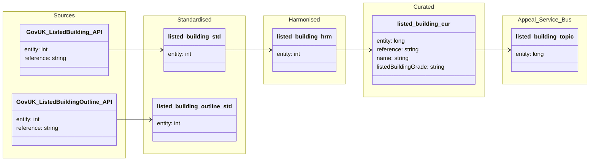

##### ODW Data Model

###### entity: listed-building

Data model for listed-building entity showing data flow from the Gov.uk Planning Data API source through to curated, and publication to the Appeals Back Office Service Bus.

Tables and views

- Standardised
  - odw_standardised_db.listed_building
  - odw_standardised_db.listed_building_outline

- Harmonised
  - odw_harmonised_db.listed_building

- Curated
  - odw_curated_db.listed_building

- Service Bus
  - listed_building_topic

Orchestration and lineage

- Notebooks and SQL scripts
  - py_listed_building_raw_to_std (loads listed_building.json into odw_standardised_db.listed_building)
  - py_listed_building_outline_raw_to_std (loads listed building outline data into odw_standardised_db.listed_building_outline)
  - listed_building (builds odw_harmonised_db.listed_building from standardised listed building data)
  - listed_building_curated (builds odw_curated_db.listed_building from harmonised listed building data)
  - listed_building_topic (publishes curated listed building data to the Appeals Back Office Service Bus)
