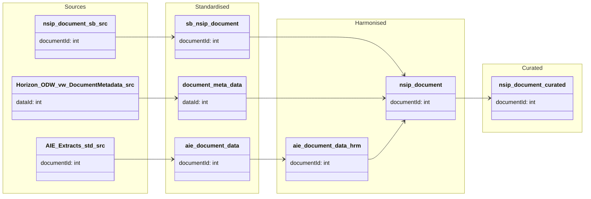

#### ODW Data Model

##### entity: nsip-document

Data model for nsip-document entity showing data flow from source to curated.



Tables and views
- Standardised
  - odw_standardised_db.sb_nsip_document
  - odw_standardised_db.document_meta_data
  - odw_standardised_db.aie_document_data
- Harmonised
  - odw_harmonised_db.sb_nsip_document (service bus staging in harmonised)
  - odw_harmonised_db.nsip_document (final harmonised for NSIP documents)
  - odw_harmonised_db.aie_document_data (harmonised AIE document data)
- Curated
  - odw_curated_db.nsip_document (external curated table)


Orchestration and lineage
- Pipelines
  - workspace/pipeline/pln_service_bus_nsip_document.json (ingest service bus to std sb_nsip_document)
  - workspace/pipeline/pln_horizon_document_metadata.json (standardise Horizon document metadata)
  - workspace/pipeline/pln_aie_document_data.json (standardise and harmonise AIE document data)
  - workspace/pipeline/pln_document_metadata_main.json (orchestrates NSIP doc flow incl. service bus, Horizon, AIE)
  - workspace/pipeline/pln_curated.json (writes curated nsip_document)
- Notebooks and SQL scripts
  - workspace/notebook/py_sb_horizon_harmonised_nsip_document.json (builds odw_harmonised_db.nsip_document from std inputs)
  - workspace/notebook/nsip_document.json (builds odw_curated_db.nsip_document from harmonised)
  - workspace/notebook/py_horizon_harmonised_aie_document.json (harmonises AIE document data)
  - workspace/sqlscript/document_meta_data.json (creates ODW.vw_document_meta_data)
```
