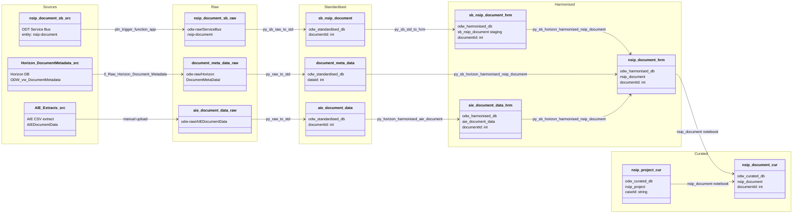

#### ODW Data Model

##### entity: nsip-document

Data model for nsip-document entity showing data flow from source to curated.


```mermaid

classDiagram

    direction LR

    namespace Sources {

        class nsip_document_sb_src {
            ODT Service Bus
            entity: nsip-document
        }

        class Horizon_DocumentMetadata_src {
            Horizon DB
            ODW_vw_DocumentMetadata
        }

        class AIE_Extracts_src {
            AIE CSV extract
            AIEDocumentData
        }
    }

    namespace Raw {

        class nsip_document_sb_raw {
            odw-raw/ServiceBus
            nsip-document/
        }

        class document_meta_data_raw {
            odw-raw/Horizon
            DocumentMetaData/
        }

        class aie_document_data_raw {
            odw-raw/AIEDocumentData
        }
    }

    namespace Standardised {

        class sb_nsip_document {
            odw_standardised_db
            documentId: int
        }

        class document_meta_data {
            odw_standardised_db
            dataId: int
        }

        class aie_document_data {
            odw_standardised_db
            documentId: int
        }
    }

    namespace Harmonised {

        class sb_nsip_document_hrm {
            odw_harmonised_db
            sb_nsip_document staging
            documentId: int
        }

        class aie_document_data_hrm {
            odw_harmonised_db
            aie_document_data
            documentId: int
        }

        class nsip_document_hrm {
            odw_harmonised_db
            nsip_document
            documentId: int
        }
    }

    namespace Curated {

        class nsip_project_cur {
            odw_curated_db
            nsip_project
            caseId: string
        }

        class nsip_document_cur {
            odw_curated_db
            nsip_document
            documentId: int
        }
    }

`nsip_document_sb_src` --> `nsip_document_sb_raw` : pln_trigger_function_app
`Horizon_DocumentMetadata_src` --> `document_meta_data_raw` : 0_Raw_Horizon_Document_Metadata
`AIE_Extracts_src` --> `aie_document_data_raw` : manual upload

`nsip_document_sb_raw` --> `sb_nsip_document` : py_sb_raw_to_std
`document_meta_data_raw` --> `document_meta_data` : py_raw_to_std
`aie_document_data_raw` --> `aie_document_data` : py_raw_to_std

`sb_nsip_document` --> `sb_nsip_document_hrm` : py_sb_std_to_hrm
`aie_document_data` --> `aie_document_data_hrm` : py_horizon_harmonised_aie_document

`sb_nsip_document_hrm` --> `nsip_document_hrm` : py_sb_horizon_harmonised_nsip_document
`document_meta_data` --> `nsip_document_hrm` : py_sb_horizon_harmonised_nsip_document
`aie_document_data_hrm` --> `nsip_document_hrm` : py_sb_horizon_harmonised_nsip_document

`nsip_document_hrm` --> `nsip_document_cur` : nsip_document notebook
`nsip_project_cur` --> `nsip_document_cur` : nsip_document notebook


```

Tables and views
- Raw (Azure Data Lake odw-raw)
  - odw-raw/ServiceBus/nsip-document/ (service bus messages landed by function app)
  - odw-raw/Horizon/DocumentMetaData/ (Horizon document metadata extract)
  - odw-raw/AIEDocumentData/ (AIE CSV extract — manual upload)
- Standardised
  - odw_standardised_db.sb_nsip_document (service bus messages)
  - odw_standardised_db.document_meta_data (Horizon document metadata)
  - odw_standardised_db.aie_document_data (AIE document extracts)
- Harmonised
  - odw_harmonised_db.sb_nsip_document (service bus staging table — output of py_sb_std_to_hrm)
  - odw_harmonised_db.aie_document_data (harmonised AIE document data — output of py_horizon_harmonised_aie_document)
  - odw_harmonised_db.nsip_document (merged harmonised table combining all three sources)
- Curated
  - odw_curated_db.nsip_project (lookup join used when building curated nsip_document)
  - odw_curated_db.nsip_document (external curated table)
- MiPINS
  - No MiPINS curated step for this entity
- Views
  - ODW.vw_document_meta_data (Synapse SQL view over odw_harmonised_db.document_meta_data)


Orchestration and lineage
- Pipelines
  - workspace/pipeline/pln_service_bus_nsip_document.json
    - Src to Raw: pln_trigger_function_app (reads SB messages → odw-raw/ServiceBus/nsip-document/)
    - Raw to Std: py_sb_raw_to_std → odw_standardised_db.sb_nsip_document
    - Std to Hrm: py_sb_std_to_hrm → odw_harmonised_db.sb_nsip_document (staging)
  - workspace/pipeline/pln_horizon_document_metadata.json
    - Src to Raw: 0_Raw_Horizon_Document_Metadata (Horizon DB → odw-raw/Horizon/DocumentMetaData/)
    - Raw to Std: py_raw_to_std → odw_standardised_db.document_meta_data
  - workspace/pipeline/pln_aie_document_data.json
    - Src to Raw: manual CSV upload → odw-raw/AIEDocumentData/
    - Raw to Std: py_raw_to_std → odw_standardised_db.aie_document_data
    - Std to Hrm: py_horizon_harmonised_aie_document → odw_harmonised_db.aie_document_data
  - workspace/pipeline/pln_document_metadata_main.json (master orchestration)
    - Runs pln_service_bus_nsip_document, pln_horizon_document_metadata, pln_aie_document_data in parallel
    - Then: Harmonised to Curated (nsip_document notebook) → odw_curated_db.nsip_document
    - ⚠️ GAP: py_sb_horizon_harmonised_nsip_document (merges all sources into odw_harmonised_db.nsip_document) is not called from this pipeline
  - workspace/pipeline/pln_curated.json (also writes curated nsip_document independently)
- Notebooks
  - workspace/notebook/py_sb_horizon_harmonised_nsip_document.json
    - Reads: odw_harmonised_db.sb_nsip_document + odw_standardised_db.document_meta_data + odw_harmonised_db.aie_document_data
    - Writes: odw_harmonised_db.nsip_document
    - ⚠️ NOT currently referenced by any pipeline
  - workspace/notebook/nsip_document.json
    - Reads: odw_harmonised_db.nsip_document + odw_curated_db.nsip_project
    - Writes: odw_curated_db.nsip_document
  - workspace/notebook/py_horizon_harmonised_aie_document.json
    - Reads: odw_standardised_db.aie_document_data
    - Writes: odw_harmonised_db.aie_document_data
- SQL scripts
  - workspace/sqlscript/document_meta_data.json (creates ODW.vw_document_meta_data over odw_harmonised_db.document_meta_data)
```
