#### ODW Data Model

##### entity: nsip-exam-timetable

Data model for nsip-exam-timetable entity showing data flow from source to curated.

```mermaid

classDiagram

    direction LR

    namespace Sources {

        class nsip_exam_timetable_sb_src {
            ODT Service Bus
            entity: nsip-exam-timetable
        }

        class Horizon_ExamTimetable_src {
            Horizon DB
            ODW_vw_ExamTimetable
        }
    }

    namespace Raw {

        class nsip_exam_timetable_raw {
            odw-raw/ServiceBus
            nsip-exam-timetable/
        }

        class horizon_exam_timetable_raw {
            odw-raw/Horizon
            ExamTimetable/
        }
    }

    namespace Standardised {

        class sb_nsip_exam_timetable {
            odw_standardised_db
            eventId: int
        }

        class horizon_examination_timetable {
            odw_standardised_db
            ID: int
        }
    }

    namespace Harmonised {

        class sb_nsip_exam_timetable_hrm {
            odw_harmonised_db
            sb_nsip_exam_timetable staging
            eventId: int
        }

        class nsip_exam_timetable_hrm {
            odw_harmonised_db
            nsip_exam_timetable
            eventId: int
        }
    }

    namespace Curated {

        class nsip_project_cur {
            odw_curated_db
            nsip_project lookup
            caseId: string
        }

        class nsip_exam_timetable_cur {
            odw_curated_db
            nsip_exam_timetable
            eventId: int
        }
    }

`nsip_exam_timetable_sb_src` --> `nsip_exam_timetable_raw` : pln_trigger_function_app
`Horizon_ExamTimetable_src` --> `horizon_exam_timetable_raw` : 0_Raw_Horizon_NSIP_Exam_Timetable

`nsip_exam_timetable_raw` --> `sb_nsip_exam_timetable` : py_raw_to_std + py_service_bus_json_to_csv
`horizon_exam_timetable_raw` --> `horizon_examination_timetable` : py_raw_to_std

`sb_nsip_exam_timetable` --> `sb_nsip_exam_timetable_hrm` : py_std_to_hrm

`sb_nsip_exam_timetable_hrm` --> `nsip_exam_timetable_hrm` : py_sb_horizon_harmonised_nsip_exam_timetable
`horizon_examination_timetable` --> `nsip_exam_timetable_hrm` : py_sb_horizon_harmonised_nsip_exam_timetable

`nsip_exam_timetable_hrm` --> `nsip_exam_timetable_cur` : examination_timetable notebook
`nsip_project_cur` --> `nsip_exam_timetable_cur` : examination_timetable notebook

```

Tables and views
- Raw (Azure Data Lake odw-raw)
  - odw-raw/ServiceBus/nsip-exam-timetable/ (service bus messages landed by function app)
  - odw-raw/Horizon/ExamTimetable/ (Horizon exam timetable extract)
- Standardised
  - odw_standardised_db.sb_nsip_exam_timetable (service bus messages, JSON converted to CSV)
  - odw_standardised_db.horizon_examination_timetable (Horizon exam timetable data)
- Harmonised
  - odw_harmonised_db.sb_nsip_exam_timetable (service bus staging — output of py_std_to_hrm)
  - odw_harmonised_db.nsip_exam_timetable (merged harmonised table)
  - odw_harmonised_db.nsip_project (lookup used by harmonisation notebook)
- Curated
  - odw_curated_db.nsip_project (lookup join used when building curated)
  - odw_curated_db.nsip_exam_timetable (external curated table)
- MiPINS
  - No MiPINS curated step for this entity

Orchestration and lineage
- Pipelines
  - workspace/pipeline/pln_service_bus_nsip_exam_timetable.json
    - Src to Raw: pln_trigger_function_app → odw-raw/ServiceBus/nsip-exam-timetable/
    - Raw to Std: py_raw_to_std + py_service_bus_json_to_csv → odw_standardised_db.sb_nsip_exam_timetable
    - Std to Hrm: py_std_to_hrm → odw_harmonised_db.sb_nsip_exam_timetable (staging)
  - workspace/pipeline/pln_horizon_nsip_exam_timetable.json
    - Src to Raw: 0_Raw_Horizon_NSIP_Exam_Timetable → odw-raw/Horizon/ExamTimetable/
    - Raw to Std: py_raw_to_std → odw_standardised_db.horizon_examination_timetable
- Notebooks
  - workspace/notebook/py_sb_horizon_harmonised_nsip_exam_timetable.json
    - Reads: odw_harmonised_db.sb_nsip_exam_timetable + odw_standardised_db.horizon_examination_timetable + odw_harmonised_db.nsip_project
    - Writes: odw_harmonised_db.nsip_exam_timetable
    - Only referenced in release pipelines (rel_1309_nsip_exam, rel_35_0_0_watermark)
  - workspace/notebook/examination_timetable.json
    - Reads: odw_harmonised_db.nsip_exam_timetable + odw_curated_db.nsip_project
    - Writes: odw_curated_db.nsip_exam_timetable