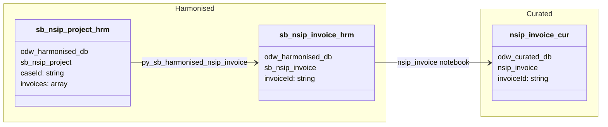

#### ODW Data Model

##### entity: nsip-invoice

Data model for nsip-invoice entity showing data flow from source to curated.

Note: nsip-invoice is not an independent Service Bus entity. Invoice data is nested within nsip-project
Service Bus messages and extracted via a dedicated harmonisation notebook.

Tables and views
- Raw / Standardised
  - Invoice data is embedded in nsip-project Service Bus messages — see nsip-project data model for the Raw → Standardised flow
- Harmonised
  - odw_harmonised_db.sb_nsip_project (source — nested invoice array; populated by the nsip-project pipeline)
  - odw_harmonised_db.sb_nsip_invoice (exploded invoice records — output of py_sb_harmonised_nsip_invoice)
- Curated
  - odw_curated_db.nsip_invoice (external curated table)
- MiPINS
  - No MiPINS curated step for this entity

Orchestration and lineage
- Pipelines
  - No dedicated source pipeline. Invoice data is derived from the nsip-project flow.
  - workspace/pipeline/pln_curated.json calls the nsip_invoice curated notebook
- Notebooks
  - workspace/notebook/py_sb_harmonised_nsip_invoice.json
    - Reads: odw_harmonised_db.sb_nsip_project (explodes nested invoice array)
    - Writes: odw_harmonised_db.sb_nsip_invoice
    - ⚠️ Not referenced in any operational pipeline
  - workspace/notebook/nsip_invoice.json
    - Reads: odw_harmonised_db.sb_nsip_invoice
    - Writes: odw_curated_db.nsip_invoice
