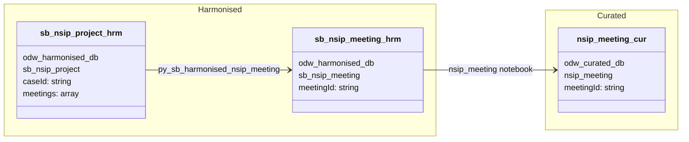

#### ODW Data Model

##### entity: nsip-meeting

Data model for nsip-meeting entity showing data flow from source to curated.

Note: nsip-meeting is not an independent Service Bus entity. Meeting data is nested within nsip-project
Service Bus messages and extracted via a dedicated harmonisation notebook.

Tables and views
- Raw / Standardised
  - Meeting data is embedded in nsip-project Service Bus messages — see nsip-project data model for the Raw → Standardised flow
- Harmonised
  - odw_harmonised_db.sb_nsip_project (source — nested meetings array; populated by the nsip-project pipeline)
  - odw_harmonised_db.sb_nsip_meeting (exploded meeting records with SCD Type 2 — output of py_sb_harmonised_nsip_meeting)
- Curated
  - odw_curated_db.nsip_meeting (external curated table)
- MiPINS
  - No MiPINS curated step for this entity

Orchestration and lineage
- Pipelines
  - No dedicated source pipeline. Meeting data is derived from the nsip-project flow.
  - workspace/pipeline/pln_curated.json calls the nsip_meeting curated notebook
- Notebooks
  - workspace/notebook/py_sb_harmonised_nsip_meeting.json
    - Reads: odw_harmonised_db.sb_nsip_project (explodes nested meetings array, applies SCD Type 2)
    - Writes: odw_harmonised_db.sb_nsip_meeting
    - Not referenced in any operational pipeline
  - workspace/notebook/nsip_meeting.json
    - Reads: odw_harmonised_db.sb_nsip_meeting
    - Writes: odw_curated_db.nsip_meeting
