#### ODW Data Model

##### entity: nsip-project-update

Data model for nsip-project-update entity showing data flow from source to curated.

```mermaid

classDiagram

    direction LR

    namespace Sources {

        class nsip_project_update_sb_src {
            ODT Service Bus
            entity: nsip-project-update
        }
    }

    namespace Raw {

        class nsip_project_update_raw {
            odw-raw/ServiceBus
            nsip-project-update/
        }
    }

    namespace Standardised {

        class sb_nsip_project_update {
            odw_standardised_db
            caseId: string
        }
    }

    namespace Harmonised {

        class sb_nsip_project_update_hrm {
            odw_harmonised_db
            sb_nsip_project_update
            caseId: string
        }
    }

    namespace Curated {

        class nsip_project_update_cur {
            odw_curated_db
            nsip_project_update
            caseId: string
        }
    }

`nsip_project_update_sb_src` --> `nsip_project_update_raw` : pln_trigger_function_app

`nsip_project_update_raw` --> `sb_nsip_project_update` : py_raw_to_std + py_service_bus_json_to_csv

`sb_nsip_project_update` --> `sb_nsip_project_update_hrm` : py_std_to_hrm

`sb_nsip_project_update_hrm` --> `nsip_project_update_cur` : curated step

```

Tables and views
- Raw (Azure Data Lake odw-raw)
  - odw-raw/ServiceBus/nsip-project-update/ (service bus messages landed by function app)
- Standardised
  - odw_standardised_db.sb_nsip_project_update (service bus messages, JSON converted to CSV)
- Harmonised
  - odw_harmonised_db.sb_nsip_project_update (harmonised staging table — output of py_std_to_hrm; no separate merge step)
- Curated
  - odw_curated_db.nsip_project_update (external curated table)
- MiPINS
  - No MiPINS curated step for this entity

Orchestration and lineage
- Pipelines
  - workspace/pipeline/pln_service_bus_nsip_project_update.json
    - Src to Raw: pln_trigger_function_app → odw-raw/ServiceBus/nsip-project-update/
    - Raw to Std: py_raw_to_std + py_service_bus_json_to_csv → odw_standardised_db.sb_nsip_project_update
    - Std to Hrm: py_std_to_hrm → odw_harmonised_db.sb_nsip_project_update
  - Called from: workspace/pipeline/pln_applications_master.json
