#### ODW Data Model

##### entity: nsip-project

Data model for nsip-project entity showing data flow from source to curated.

```mermaid

classDiagram

    direction LR

    namespace Sources {

        class nsip_project_sb_src {
            ODT Service Bus
            entity: nsip-project
        }

        class Horizon_NSIPData_src {
            Horizon DB
            HZN_NSIP_Data_Copy
        }
    }

    namespace Raw {

        class nsip_project_raw {
            odw-raw/ServiceBus
            nsip-project/
        }

        class horizon_nsip_data_raw {
            odw-raw/Horizon
            NSIPData/
        }
    }

    namespace Standardised {

        class sb_nsip_project {
            odw_standardised_db
            caseId: string
        }

        class horizon_nsip_data {
            odw_standardised_db
            casenodeid: int
        }
    }

    namespace Harmonised {

        class sb_nsip_project_hrm {
            odw_harmonised_db
            sb_nsip_project staging
            caseId: string
        }

        class nsip_project_hrm {
            odw_harmonised_db
            nsip_project
            caseId: string
        }
    }

    namespace Curated {

        class nsip_project_cur {
            odw_curated_db
            nsip_project
            caseId: string
        }
    }

    namespace MiPINS {

        class nsip_project_mipins {
            MiPINS SQL DB
            odw.nsip_project_curated_mipins
            caseId: int
        }
    }

`nsip_project_sb_src` --> `nsip_project_raw` : pln_trigger_function_app
`Horizon_NSIPData_src` --> `horizon_nsip_data_raw` : 0_Raw_Horizon_NSIP_Data

`nsip_project_raw` --> `sb_nsip_project` : py_sb_raw_to_std
`horizon_nsip_data_raw` --> `horizon_nsip_data` : py_raw_to_std

`sb_nsip_project` --> `sb_nsip_project_hrm` : py_sb_std_to_hrm

`sb_nsip_project_hrm` --> `nsip_project_hrm` : py_sb_horizon_harmonised_nsip_project
`horizon_nsip_data` --> `nsip_project_hrm` : py_sb_horizon_harmonised_nsip_project

`nsip_project_hrm` --> `nsip_project_cur` : nsip_data notebook

`nsip_project_hrm` --> `nsip_project_mipins` : pln_copy_nsip_project_to_mipins

```

Tables and views
- Raw (Azure Data Lake odw-raw)
  - odw-raw/ServiceBus/nsip-project/ (service bus messages landed by function app)
  - odw-raw/Horizon/NSIPData/ (Horizon NSIP project data extract)
- Standardised
  - odw_standardised_db.sb_nsip_project (service bus messages)
  - odw_standardised_db.horizon_nsip_data (Horizon NSIP project data)
- Harmonised
  - odw_harmonised_db.sb_nsip_project (service bus staging — output of py_sb_std_to_hrm; also used by nsip_invoice and nsip_meeting harmonisation)
  - odw_harmonised_db.nsip_project (merged harmonised table)
- Curated
  - odw_curated_db.nsip_project (external curated table; also used as lookup by other curated notebooks)
- MiPINS
  - MiPINS SQL DB: odw.nsip_project_curated_mipins (copied from odw_harmonised_db.nsip_project via Synapse serverless SQL)
  - Note: MiPINS reads from harmonised, not curated (source dataset uses ls_ssql_builtin with db_name=odw_harmonised_db)

Orchestration and lineage
- Pipelines
  - workspace/pipeline/pln_service_bus_nsip_project.json
    - Src to Raw: pln_trigger_function_app → odw-raw/ServiceBus/nsip-project/
    - Raw to Std: py_sb_raw_to_std → odw_standardised_db.sb_nsip_project
    - Std to Hrm: py_sb_std_to_hrm → odw_harmonised_db.sb_nsip_project (staging)
  - workspace/pipeline/pln_horizon_nsip_project.json
    - Src to Raw: 0_Raw_Horizon_NSIP_Data → odw-raw/Horizon/NSIPData/
    - Raw to Std: py_raw_to_std → odw_standardised_db.horizon_nsip_data
- Notebooks
  - workspace/notebook/py_sb_horizon_harmonised_nsip_project.json
    - Reads: odw_harmonised_db.sb_nsip_project + odw_standardised_db.horizon_nsip_data
    - Writes: odw_harmonised_db.nsip_project
    - Only referenced in release pipeline (rel_1272_nsip_data)
  - workspace/notebook/nsip_data.json
    - Reads: odw_harmonised_db.nsip_project
    - Writes: odw_curated_db.nsip_project
- MiPINS pipeline
  - workspace/pipeline/pln_copy_nsip_project_to_mipins.json
    - Source: odw_harmonised_db.nsip_project (via Synapse serverless SQL pool, dataset NSIPProject.json)
    - Sink: MiPINS SQL DB — odw.nsip_project_curated_mipins
    - Pre-copy: DROP TABLE IF EXISTS [odw].[nsip_project_curated_mipins]
    - Note: copies directly from harmonised layer, bypassing odw_curated_db.nsip_project