#### ODW Data Model

##### entity: nsip-representation

Data model for nsip-representation entity showing data flow from source to curated.

```mermaid

classDiagram

    direction LR

    namespace Sources {

        class nsip_representation_sb_src {
            ODT Service Bus
            entity: nsip-representation
        }

        class Horizon_NsipRelevantReps_src {
            Horizon DB
            NSIP_Relevant_Representation
        }
    }

    namespace Raw {

        class nsip_representation_raw {
            odw-raw/ServiceBus
            nsip-representation/
        }

        class horizon_relevant_reps_raw {
            odw-raw/Horizon
            NSIPRelevantReps/
        }
    }

    namespace Standardised {

        class sb_nsip_representation {
            odw_standardised_db
            representationId: int
        }

        class horizon_nsip_relevant_representation {
            odw_standardised_db
            RelevantRepID: int
        }
    }

    namespace Harmonised {

        class sb_nsip_representation_hrm {
            odw_harmonised_db
            sb_nsip_representation staging
            representationId: int
        }

        class nsip_representation_hrm {
            odw_harmonised_db
            nsip_representation
            representationId: int
        }
    }

    namespace Curated {

        class nsip_representation_cur {
            odw_curated_db
            nsip_representation
            representationId: int
        }
    }

`nsip_representation_sb_src` --> `nsip_representation_raw` : pln_trigger_function_app
`Horizon_NsipRelevantReps_src` --> `horizon_relevant_reps_raw` : 0_Raw_Horizon_NSIP_Relevant_Reps

`nsip_representation_raw` --> `sb_nsip_representation` : py_sb_raw_to_std
`horizon_relevant_reps_raw` --> `horizon_nsip_relevant_representation` : py_raw_to_std

`sb_nsip_representation` --> `sb_nsip_representation_hrm` : py_sb_std_to_hrm

`sb_nsip_representation_hrm` --> `nsip_representation_hrm` : py_sb_horizon_harmonised_nsip_representation
`horizon_nsip_relevant_representation` --> `nsip_representation_hrm` : py_sb_horizon_harmonised_nsip_representation

`nsip_representation_hrm` --> `nsip_representation_cur` : nsip_representation notebook

```

Tables and views
- Raw (Azure Data Lake odw-raw)
  - odw-raw/ServiceBus/nsip-representation/ (service bus messages landed by function app)
  - odw-raw/Horizon/NSIPRelevantReps/ (Horizon relevant representations extract)
- Standardised
  - odw_standardised_db.sb_nsip_representation (service bus messages)
  - odw_standardised_db.horizon_nsip_relevant_representation (Horizon relevant representations)
- Harmonised
  - odw_harmonised_db.sb_nsip_representation (service bus staging — output of py_sb_std_to_hrm)
  - odw_harmonised_db.nsip_representation (merged harmonised table)
- Curated
  - odw_curated_db.nsip_representation (external curated table)
- MiPINS
  - No MiPINS curated step for this entity

Orchestration and lineage
- Pipelines
  - workspace/pipeline/pln_service_bus_nsip_representation.json
    - Src to Raw: pln_trigger_function_app → odw-raw/ServiceBus/nsip-representation/
    - Raw to Std: py_sb_raw_to_std → odw_standardised_db.sb_nsip_representation
    - Std to Hrm: py_sb_std_to_hrm → odw_harmonised_db.sb_nsip_representation (staging)
  - workspace/pipeline/pln_horizon_nsip_representation_main.json
    - Src to Raw: 0_Raw_Horizon_NSIP_Relevant_Reps → odw-raw/Horizon/NSIPRelevantReps/
    - Raw to Std: py_raw_to_std → odw_standardised_db.horizon_nsip_relevant_representation
- Notebooks
  - workspace/notebook/py_sb_horizon_harmonised_nsip_representation.json
    - Reads: odw_harmonised_db.sb_nsip_representation + odw_standardised_db.horizon_nsip_relevant_representation
    - Writes: odw_harmonised_db.nsip_representation
    - Only referenced in release pipelines (rel_1298, rel_1347, rel_2_0_11)
  - workspace/notebook/nsip_representation.json
    - Reads: odw_harmonised_db.nsip_representation
    - Writes: odw_curated_db.nsip_representation