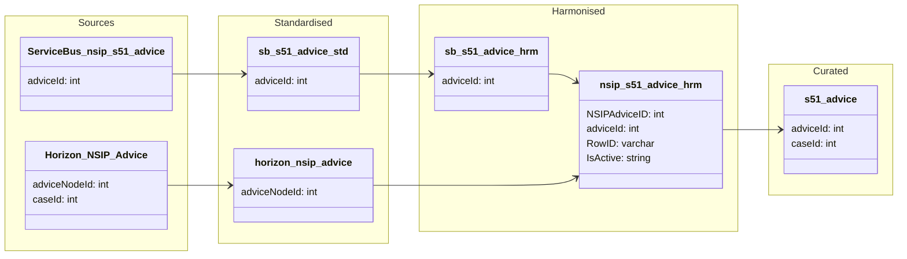

#### ODW Data Model

##### entity: nsip_s51_advice

Data model for nsip_s51_advice entity showing Service Bus and Horizon data flow from source to curated.

### Tables and views

- Standardised
  - odw_standardised_db.sb_s51_advice
  - odw_standardised_db.horizon_nsip_advice

- Harmonised
  - odw_harmonised_db.sb_s51_advice
  - odw_harmonised_db.nsip_s51_advice

- Curated
  - odw_curated_db.s51_advice

### Orchestration and lineage

- `py_sb_horizon_harmonised_nsip_s51_advice`
  - Merges Service Bus (`sb_s51_advice`) and Horizon (`horizon_nsip_advice`) data
  - Creates `odw_harmonised_db.nsip_s51_advice`

- `s51_advice`
  - Filters active records (`IsActive = 'Y'`)
  - Creates `odw_curated_db.s51_advice`

**Key Point:** Service Bus and Horizon advice data are combined in Harmonised and only active records are published to Curated.
