#### ODW Data Model

##### entity: nsip-s51-advice

Data model for nsip-s51-advice entity showing data flow from source to curated.

```mermaid

classDiagram

    direction LR

    namespace Sources {

        class nsip_s51_advice_sb_src {
            ODT Service Bus
            entity: s51-advice
        }

        class Horizon_NSIPAdvice_src {
            Horizon DB
            NSIP_Advice
        }
    }

    namespace Raw {

        class nsip_s51_advice_raw {
            odw-raw/ServiceBus
            s51-advice/
        }

        class horizon_nsip_advice_raw {
            odw-raw/Horizon
            NSIPAdvice/
        }
    }

    namespace Standardised {

        class sb_s51_advice {
            odw_standardised_db
            adviceId: int
        }

        class horizon_nsip_advice {
            odw_standardised_db
            CaseID: int
        }
    }

    namespace Harmonised {

        class sb_s51_advice_hrm {
            odw_harmonised_db
            sb_s51_advice staging
            adviceId: int
        }

        class nsip_s51_advice_hrm {
            odw_harmonised_db
            nsip_s51_advice
            adviceId: int
        }
    }

    namespace Curated {

        class s51_advice_cur {
            odw_curated_db
            s51_advice
            NSIPAdviceID: int
        }
    }

`nsip_s51_advice_sb_src` --> `nsip_s51_advice_raw` : pln_trigger_function_app
`Horizon_NSIPAdvice_src` --> `horizon_nsip_advice_raw` : 0_Raw_Horizon_NSIP_Advice

`nsip_s51_advice_raw` --> `sb_s51_advice` : py_sb_raw_to_std
`horizon_nsip_advice_raw` --> `horizon_nsip_advice` : py_raw_to_std

`sb_s51_advice` --> `sb_s51_advice_hrm` : py_sb_std_to_hrm

`sb_s51_advice_hrm` --> `nsip_s51_advice_hrm` : py_sb_horizon_harmonised_nsip_s51_advice
`horizon_nsip_advice` --> `nsip_s51_advice_hrm` : py_sb_horizon_harmonised_nsip_s51_advice

`nsip_s51_advice_hrm` --> `s51_advice_cur` : nsip_s51_advice notebook

```

Tables and views
- Raw (Azure Data Lake odw-raw)
  - odw-raw/ServiceBus/s51-advice/ (service bus messages landed by function app)
  - odw-raw/Horizon/NSIPAdvice/ (Horizon NSIP advice extract)
- Standardised
  - odw_standardised_db.sb_s51_advice (service bus messages)
  - odw_standardised_db.horizon_nsip_advice (Horizon NSIP advice data)
- Harmonised
  - odw_harmonised_db.sb_s51_advice (service bus staging — output of py_sb_std_to_hrm)
  - odw_harmonised_db.nsip_s51_advice (merged harmonised table)
- Curated
  - odw_curated_db.s51_advice (external curated table)
- MiPINS
  - No MiPINS curated step for this entity

Orchestration and lineage
- Pipelines
  - workspace/pipeline/pln_service_bus_nsip_s51_advice.json
    - Src to Raw: pln_trigger_function_app → odw-raw/ServiceBus/s51-advice/
    - Raw to Std: py_sb_raw_to_std → odw_standardised_db.sb_s51_advice
    - Std to Hrm: py_sb_std_to_hrm → odw_harmonised_db.sb_s51_advice (staging)
  - workspace/pipeline/pln_horizon_nsip_s51_advice.json
    - Src to Raw: 0_Raw_Horizon_NSIP_Advice → odw-raw/Horizon/NSIPAdvice/
    - Raw to Std: py_raw_to_std → odw_standardised_db.horizon_nsip_advice
  - workspace/pipeline/pln_nsip_s51_advice_main.json (master orchestration)
    - Runs pln_horizon_nsip_s51_advice and pln_service_bus_nsip_s51_advice in parallel
    - Then: Harmonised to Curated (nsip_s51_advice notebook) → odw_curated_db.s51_advice
    - GAP: py_sb_horizon_harmonised_nsip_s51_advice (merges sources into odw_harmonised_db.nsip_s51_advice) is not called from this pipeline
- Notebooks
  - workspace/notebook/py_sb_horizon_harmonised_nsip_s51_advice.json
    - Reads: odw_harmonised_db.sb_s51_advice + odw_standardised_db.horizon_nsip_advice
    - Writes: odw_harmonised_db.nsip_s51_advice
    - Only referenced in release pipeline (rel_1273_s51)
  - workspace/notebook/nsip_s51_advice.json
    - Reads: odw_harmonised_db.nsip_s51_advice
    - Writes: odw_curated_db.s51_advice
