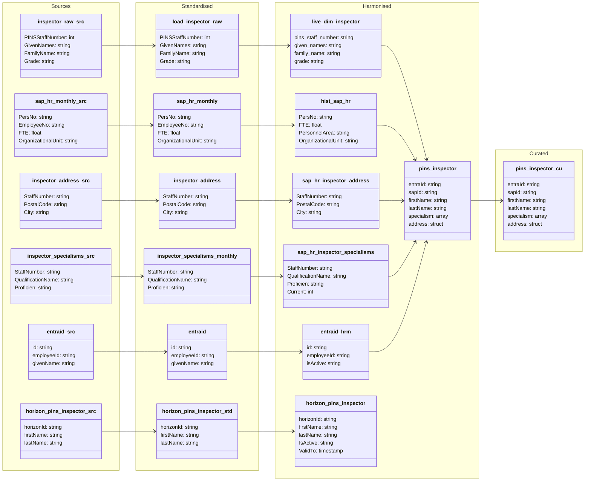

#### ODW Data Model

##### entity: pins-inspector

Data model for pins-inspector entity showing data flow from source to curated.

**Note:** This diagram shows the SAP HR-based pins_inspector entity. The horizon_pins_inspector entity (legacy Horizon system) follows a separate data flow path documented in the Harmonised section.

---

### Data Flow Summary

#### SAP HR-based pins_inspector
1. **Raw → Standardised**: Multiple SAP HR sources (HR monthly, inspector raw, address, specialisms) are ingested
2. **Standardised → Harmonised**: 
   - SAP HR data consolidated into `hist_sap_hr` and dimension tables
   - Inspector base data in `live_dim_inspector`
   - Specialisms and addresses in separate harmonised tables
3. **Harmonised Integration**: `py_harmonised_pins_inspector` notebook joins:
   - `live_dim_inspector` (base inspector data)
   - `entraid_hrm` (identity mapping)
   - `hist_sap_hr` (latest HR record per person)
   - `sap_hr_inspector_specialisms` (aggregated as array)
   - `sap_hr_inspector_address` (structured as nested object)
4. **Harmonised → Curated**: `pins_inspector` notebook filters active records (IsActive='Y')

#### Horizon-based horizon_pins_inspector (Separate Entity)
1. **Raw → Standardised**: Horizon legacy system data ingested
2. **Standardised → Harmonised**: `horizon_pins_inspector` notebook implements SCD Type 2 pattern
3. **No Curated Layer**: Remains in harmonised only for historical reference

**Key Point**: These are two separate, unmerged entities serving different purposes.
