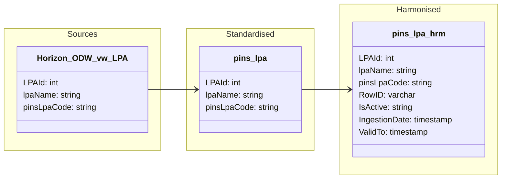

#### ODW Data Model

##### entity: pins_lpa

Data model for pins_lpa entity showing Horizon (DaRT) data flow from source through standardised and harmonised layers. This entity uses SCD Type 2 processing and does not currently have a curated layer.

### Tables and views

- Standardised
  - odw_standardised_db.pins_lpa

- Harmonised
  - odw_harmonised_db.pins_lpa

### Orchestration and lineage

- Notebooks and SQL scripts
  - py_horizon_raw_to_std (loads DaRT_LPA.csv into odw_standardised_db.pins_lpa)
  - pins_lpa (builds odw_harmonised_db.pins_lpa from odw_standardised_db.pins_lpa using MD5 hash-based change detection and SCD Type 2 processing)

**Key Point:** `pins_lpa` is a Horizon-only entity sourced from DaRT_LPA.csv and maintained in the Harmonised layer using SCD Type 2 history management.
