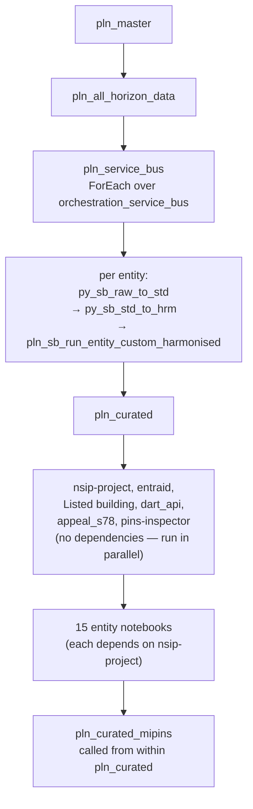

#### pln_master overview

`workspace/pipeline/pln_master.json`

`pln_master` is the top-level daily orchestrator for the ODW. It runs four child pipelines in sequence, with Teams and email notifications at each stage boundary.

#### 1. pln_all_horizon_data

`workspace/pipeline/pln_all_horizon_data.json`

Pulls all Horizon source data into raw and standardises it. Each entity's Horizon pipeline runs in parallel, writing to `odw-raw/Horizon/<entity>/` and then into `odw_standardised_db`.

#### 2. pln_service_bus

`workspace/pipeline/pln_service_bus.json`

Processes Service Bus messages for all entities using a data-driven ForEach over the `orchestration_service_bus` config dataset. For each entity the steps run in order:

```
py_sb_raw_to_std → py_sb_std_to_hrm → pln_sb_run_entity_custom_harmonised
```

- `py_sb_raw_to_std` — reads from `odw-raw/ServiceBus/<entity>/`, writes to `odw_standardised_db.sb_<entity>`
- `py_sb_std_to_hrm` — writes the staging table `odw_harmonised_db.sb_<entity>`
- `pln_sb_run_entity_custom_harmonised` — runs any entity-specific custom harmonisation notebooks (skipped if none are configured)

After the loop, `nb_sb_write_manifest_and_watermark` records the watermark for each entity.

#### 3. pln_curated

`workspace/pipeline/pln_curated.json`

Runs curated notebooks for all entities. Several activities start with no dependencies and run in parallel at the top of the pipeline: `nsip-project`, `entraid`, `Listed building`, `dart_api`, `appeal_s78`, and `pins-inspector`. The majority of entity notebooks — nsip-document, nsip-representation, nsip-s51-advice, nsip-subscription, nsip-folder, nsip-exam-timetable, nsip_invoice, nsip_meeting, appeal-document, appeal-event, appeal-event-estimate, appeal-has, appeal-folder, appeal service user, and appeal_representation — all have a `dependsOn` of the `nsip-project` activity and wait for it to succeed.

Note: the `nsip-project` activity in this pipeline runs the `nsip_data` notebook (`workspace/notebook/nsip_data.json`), which writes `odw_curated_db.nsip_project`.

#### 4. pln_curated_mipins

`workspace/pipeline/pln_curated_mipins.json`

Called as the last activity inside `pln_curated`, after every entity curated notebook has completed. Copies data from `odw_harmonised_db` into the MiPINS SQL database.


