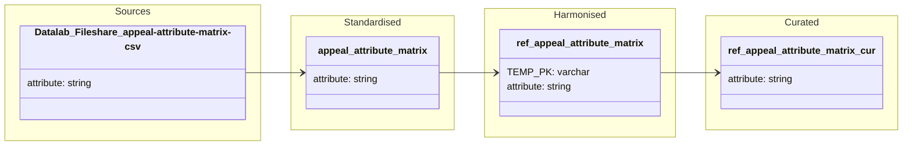

#### ODW Data Model

##### entity: ref_appeal_attribute_matrix

Data model for ref_appeal_attribute_matrix reference entity showing data flow from the Datalab fileshare CSV source through standardised, harmonised and curated layers. This is a manually maintained reference file (no Service Bus or Horizon sources); the pipeline runs whenever an updated appeal-attribute-matrix.csv is uploaded to the fileshare.

### Tables and views

- Standardised
  - odw_standardised_db.appeal_attribute_matrix

- Harmonised
  - odw_harmonised_db.ref_appeal_attribute_matrix

- Curated
  - odw_curated_db.ref_appeal_attribute_matrix

### Orchestration and lineage

- Notebooks and SQL scripts
  - appeal_attribute_matrix (loads appeal-attribute-matrix.csv into odw_standardised_db.appeal_attribute_matrix)
  - ref_appeal_attribute_matrix (builds odw_harmonised_db.ref_appeal_attribute_matrix from odw_standardised_db.appeal_attribute_matrix)
  - ref_appeal_attribute_matrix_cur (builds odw_curated_db.ref_appeal_attribute_matrix from odw_harmonised_db.ref_appeal_attribute_matrix)

**Key Point:** `ref_appeal_attribute_matrix` is a manually maintained reference entity sourced from a CSV file stored in the Datalab fileshare and promoted through Standardised, Harmonised and Curated layers for downstream consumption.
