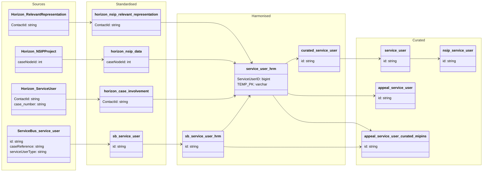

#### ODW Data Model

##### entity: service_user

Data model for service_user entity showing Service Bus and Horizon data flow from source to curated. This entity consolidates service user records from multiple Service Bus and Horizon sources and performs deduplication before publishing to curated.[1](https://pinso365.sharepoint.com/sites/OperationalDataWarehouseService/_layouts/15/Doc.aspx?sourcedoc=%7B119D5D22-F3D4-444F-971D-BFAA0268D66D%7D&file=Service%20User%20Models.vsdx&action=default&mobileredirect=true&DefaultItemOpen=1)

### Tables and views

- Standardised
  - odw_standardised_db.sb_service_user
  - odw_standardised_db.horizon_case_involvement
  - odw_standardised_db.horizon_nsip_data
  - odw_standardised_db.horizon_nsip_relevant_representation

- Harmonised
  - odw_harmonised_db.sb_service_user
  - odw_harmonised_db.service_user
  - odw_harmonised_db.curated_service_user
  - odw_harmonised_db.casework_case_involvement_dim (archived but still referenced)
  - odw_harmonised_db.nsip_project
  - odw_harmonised_db.nsip_representation
  - odw_harmonised_db.nsip_s51_advice

- Curated
  - odw_curated_db.service_user
  - odw_curated_db.appeal_service_user
  - odw_curated_db.appeal_service_user_curated_mipins
  - odw_curated_db.nsip_service_user (view)

### Orchestration and lineage

- Notebooks and SQL scripts
  - py_sb_horizon_harmonised_service_user
  - service_user
  - appeal_service_user
  - appeal_service_user_curated_mipins
  - py_sb_horizon_harmonised_nsip_project
  - py_sb_horizon_harmonised_nsip_representation
  - py_sb_horizon_harmonised_nsip_s51_advice

**Key Point:** `service_user` is the master consolidated service-user entity. It combines Service Bus and Horizon-derived service users, applies deduplication using names, telephone numbers, email addresses and address matching, and publishes the unified result to curated. `appeal_service_user` and `appeal_service_user_curated_mipins` are downstream curated views built using different filtering and aggregation rules.
