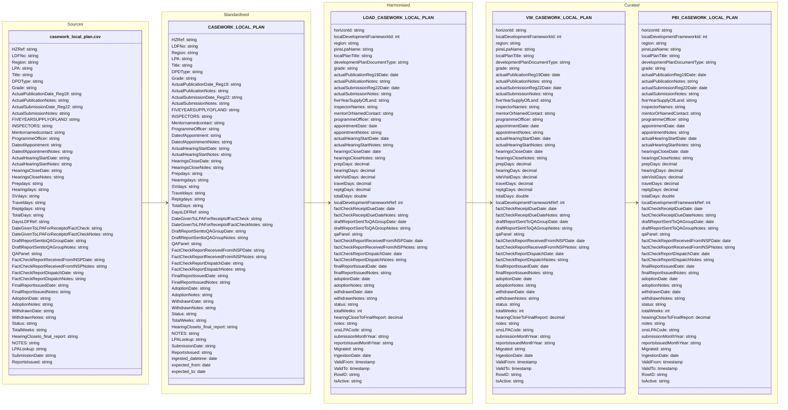

#### Unmanaged Data Casework Local Plan Data Model

##### entity: CASEWORK_LOCAL_PLAN

Data model for casework_local_plan entity showing data flow from source to curated layer.

```mermaid
classDiagram

    direction LR

    namespace Sources {

        class casework_local_plan.csv {
            HZRef: string
            LDFNo: string
            Region: string
            LPA: string
            Title: string
            DPDType: string
            Grade: string
            ActualPublicationDate_Reg19: string
            ActualPublicationNotes: string
            ActualSubmissionDate_Reg22: string
            ActualSubmissionNotes: string
            FIVEYEARSUPPLYOFLAND: string
            INSPECTORS: string
            Mentornamedcontact: string
            ProgrammeOfficer: string
            DateofAppointment: string
            DateofAppointmentNotes: string
            ActualHearingStartDate: string
            ActualHearingStartNotes: string
            HearingsCloseDate: string
            HearingsCloseNotes: string
            Prepdays: string
            Hearingdays: string
            SVdays: string
            Traveldays: string
            Reptgdays: string
            TotalDays: string
            DaysLDFRef: string
            DateGivenToLPAForReceiptofFactCheck: string
            DateGivenToLPAForReceiptofFactCheckNotes: string
            DraftReportSenttoQAGroupDate: string
            DraftReportSenttoQAGroupNotes: string
            QAPanel: string
            FactCheckReportReceivedFromINSPDate: string
            FactCheckReportReceivedFromINSPNotes: string
            FactCheckReportDispatchDate: string
            FactCheckReportDispatchNotes: string
            FinalReportIssuedDate: string
            FinalReportIssuedNotes: string
            AdoptionDate: string
            AdoptionNotes: string
            WithdrawnDate: string
            WithdrawnNotes: string
            Status: string
            TotalWeeks: string
            HearingCloseto_final_report: string
            NOTES: string
            LPALookup: string
            SubmissionDate: string
            ReportsIssued: string
        }
    }

    namespace Standardised {

        class CASEWORK_LOCAL_PLAN {
            HZRef: string
            LDFNo: string
            Region: string
            LPA: string
            Title: string
            DPDType: string
            Grade: string
            ActualPublicationDate_Reg19: string
            ActualPublicationNotes: string
            ActualSubmissionDate_Reg22: string
            ActualSubmissionNotes: string
            FIVEYEARSUPPLYOFLAND: string
            INSPECTORS: string
            Mentornamedcontact: string
            ProgrammeOfficer: string
            DateofAppointment: string
            DateofAppointmentNotes: string
            ActualHearingStartDate: string
            ActualHearingStartNotes: string
            HearingsCloseDate: string
            HearingsCloseNotes: string
            Prepdays: string
            Hearingdays: string
            SVdays: string
            Traveldays: string
            Reptgdays: string
            TotalDays: string
            DaysLDFRef: string
            DateGivenToLPAForReceiptofFactCheck: string
            DateGivenToLPAForReceiptofFactCheckNotes: string
            DraftReportSenttoQAGroupDate: string
            DraftReportSenttoQAGroupNotes: string
            QAPanel: string
            FactCheckReportReceivedFromINSPDate: string
            FactCheckReportReceivedFromINSPNotes: string
            FactCheckReportDispatchDate: string
            FactCheckReportDispatchNotes: string
            FinalReportIssuedDate: string
            FinalReportIssuedNotes: string
            AdoptionDate: string
            AdoptionNotes: string
            WithdrawnDate: string
            WithdrawnNotes: string
            Status: string
            TotalWeeks: string
            HearingCloseto_final_report: string
            NOTES: string
            LPALookup: string
            SubmissionDate: string
            ReportsIssued: string
            ingested_datetime: date
            expected_from: date
            expected_to: date
        }
    }

    namespace Harmonised {

        class LOAD_CASEWORK_LOCAL_PLAN {
            horizonId: string
            localDevelopmentFrameworkId: int
            region: string
            pinsLpaName: string
            localPlanTitle: string
            developmentPlanDocumentType: string
            grade: string
            actualPublicationReg19Date: date
            actualPublicationNotes: string
            actualSubmissionReg22Date: date
            actualSubmissionNotes: string
            fiveYearSupplyOfLand: string
            inspectorNames: string
            mentorOrNamedContact: string
            programmeOfficer: string
            appointmentDate: date
            appointmentNotes: string
            actualHearingStartDate: date
            actualHearingStartNotes: string
            hearingsCloseDate: date
            hearingsCloseNotes: string
            prepDays: decimal
            hearingDays: decimal
            siteVisitDays: decimal
            travelDays: decimal
            reptgDays: decimal
            totalDays: double
            localDevelopmentFrameworkRef: int
            factCheckReceiptDueDate: date
            factCheckReceiptDueDateNotes: string
            draftReportSentToQAGroupDate: date
            draftReportSentToQAGroupNotes: string
            qaPanel: string
            factCheckReportReceivedFromINSPDate: date
            factCheckReportReceivedFromINSPNotes: string
            factCheckReportDispatchDate: date
            factCheckReportDispatchNotes: string
            finalReportIssuedDate: date
            finalReportIssuedNotes: string
            adoptionDate: date
            adoptionNotes: string
            withdrawnDate: date
            withdrawnNotes: string
            status: string
            totalWeeks: int
            hearingCloseToFinalReport: decimal
            notes: string
            onsLPACode: string
            submissionMonthYear: string
            reportsIssuedMonthYear: string
            Migrated: string
            IngestionDate: date
            ValidFrom: timestamp
            ValidTo: timestamp
            RowID: string
            IsActive: string
        }
    }

    namespace Curated {

        class VW_CASEWORK_LOCAL_PLAN {
            horizonId: string
            localDevelopmentFrameworkId: int
            region: string
            pinsLpaName: string
            localPlanTitle: string
            developmentPlanDocumentType: string
            grade: string
            actualPublicationReg19Date: date
            actualPublicationNotes: string
            actualSubmissionReg22Date: date
            actualSubmissionNotes: string
            fiveYearSupplyOfLand: string
            inspectorNames: string
            mentorOrNamedContact: string
            programmeOfficer: string
            appointmentDate: date
            appointmentNotes: string
            actualHearingStartDate: date
            actualHearingStartNotes: string
            hearingsCloseDate: date
            hearingsCloseNotes: string
            prepDays: decimal
            hearingDays: decimal
            siteVisitDays: decimal
            travelDays: decimal
            reptgDays: decimal
            totalDays: double
            localDevelopmentFrameworkRef: int
            factCheckReceiptDueDate: date
            factCheckReceiptDueDateNotes: string
            draftReportSentToQAGroupDate: date
            draftReportSentToQAGroupNotes: string
            qaPanel: string
            factCheckReportReceivedFromINSPDate: date
            factCheckReportReceivedFromINSPNotes: string
            factCheckReportDispatchDate: date
            factCheckReportDispatchNotes: string
            finalReportIssuedDate: date
            finalReportIssuedNotes: string
            adoptionDate: date
            adoptionNotes: string
            withdrawnDate: date
            withdrawnNotes: string
            status: string
            totalWeeks: int
            hearingCloseToFinalReport: decimal
            notes: string
            onsLPACode: string
            submissionMonthYear: string
            reportsIssuedMonthYear: string
            Migrated: string
            IngestionDate: date
            ValidFrom: timestamp
            ValidTo: timestamp
            RowID: string
            IsActive: string
        }

        class PBI_CASEWORK_LOCAL_PLAN {
            horizonId: string
            localDevelopmentFrameworkId: int
            region: string
            pinsLpaName: string
            localPlanTitle: string
            developmentPlanDocumentType: string
            grade: string
            actualPublicationReg19Date: date
            actualPublicationNotes: string
            actualSubmissionReg22Date: date
            actualSubmissionNotes: string
            fiveYearSupplyOfLand: string
            inspectorNames: string
            mentorOrNamedContact: string
            programmeOfficer: string
            appointmentDate: date
            appointmentNotes: string
            actualHearingStartDate: date
            actualHearingStartNotes: string
            hearingsCloseDate: date
            hearingsCloseNotes: string
            prepDays: decimal
            hearingDays: decimal
            siteVisitDays: decimal
            travelDays: decimal
            reptgDays: decimal
            totalDays: double
            localDevelopmentFrameworkRef: int
            factCheckReceiptDueDate: date
            factCheckReceiptDueDateNotes: string
            draftReportSentToQAGroupDate: date
            draftReportSentToQAGroupNotes: string
            qaPanel: string
            factCheckReportReceivedFromINSPDate: date
            factCheckReportReceivedFromINSPNotes: string
            factCheckReportDispatchDate: date
            factCheckReportDispatchNotes: string
            finalReportIssuedDate: date
            finalReportIssuedNotes: string
            adoptionDate: date
            adoptionNotes: string
            withdrawnDate: date
            withdrawnNotes: string
            status: string
            totalWeeks: int
            hearingCloseToFinalReport: decimal
            notes: string
            onsLPACode: string
            submissionMonthYear: string
            reportsIssuedMonthYear: string
            Migrated: string
            IngestionDate: date
            ValidFrom: timestamp
            ValidTo: timestamp
            RowID: string
            IsActive: string
        }
    }

%% Source to Standardised Flow
`casework_local_plan.csv` --> `CASEWORK_LOCAL_PLAN`

%% Standardised to Harmonised Flow
`CASEWORK_LOCAL_PLAN` --> `LOAD_CASEWORK_LOCAL_PLAN`

%% Harmonised to Curated Flow
`LOAD_CASEWORK_LOCAL_PLAN` --> `VW_CASEWORK_LOCAL_PLAN`

%% Curated to Curated Flow
`VW_CASEWORK_LOCAL_PLAN` --> `PBI_CASEWORK_LOCAL_PLAN`
```
