#### Unmanaged Data Casework Green Specialist Case Data Model

##### entity: GREEN_SPECIALIST_CASE

Data model for green_specialist_case entity showing data flow from source to curated.
Covers three specialist case sub-types — **Hedgerow**, **High Hedges**, and **TPO / TRN** —
all loaded through a single harmonised table and fanned out into type-specific curated views and PBI tables.
Includes a full **SCD Type 2** history table for all sub-types.
Reduced the column sets in the Curated layer tables as they are replcas of Harmonised layer

```mermaid
classDiagram

    direction LR

    namespace Sources {

        class green_specialist_case_csv {
            greenCaseType : string
            greenCaseId : string
            FullReference : string
            horizonId : string
            linkedGreenCaseId : string
            caseOfficerName : string
            caseOfficerEmail : string
            appealType : string
            procedure : string
            processingState : string
            LPACode : string
            LPAName : string
            appellantName : string
            agentName : string
            SiteAddressDescription : string
            sitePostcode : string
            otherPartyName : string
            receiptDate : string
            validDate : string
            startDate : string
            QuDate : string
            QuRecDate : string
            sixWeeks : string
            eightWeeks : string
            nineWeeks : string
            eventType : string
            eventDate : string
            eventTime : string
            inspectorName : string
            inspectorStaffNumber : string
            decision : string
            decisionDate : string
            DateWithdrawnorTurnedAway : string
            comments : string
            active : string
        }
    }

    namespace Standardised {

        class GREEN_SPECIALIST_CASE {
            greenCaseType : string
            greenCaseId : string
            FullReference : string
            horizonId : string
            linkedGreenCaseId : string
            caseOfficerName : string
            caseOfficerEmail : string
            appealType : string
            procedure : string
            processingState : string
            LPACode : string
            LPAName : string
            appellantName : string
            agentName : string
            SiteAddressDescription : string
            sitePostcode : string
            otherPartyName : string
            receiptDate : string
            validDate : string
            startDate : string
            QuDate : string
            QuRecDate : string
            sixWeeks : string
            eightWeeks : string
            nineWeeks : string
            eventType : string
            eventDate : string
            eventTime : string
            inspectorName : string
            inspectorStaffNumber : string
            decision : string
            decisionDate : string
            DateWithdrawnorTurnedAway : string
            comments : string
            active : string
            ingested_datetime : date
            expected_from : date
            expected_to : date
        }
    }

    namespace Harmonised {

        class LOAD_GREEN_SPECIALIST_CASE {
            casework_specialist_id : bigint
            greenCaseType : string
            greenCaseId : string
            caseReference : string
            horizonId : string
            linkedGreenCaseId : string
            caseOfficerName : string
            caseOfficerEmail : string
            appealType : string
            procedure : string
            processingState : string
            pinsLpaCode : string
            pinsLpaName : string
            appellantName : string
            agentName : string
            SiteAddressDescription : string
            sitePostcode : string
            otherPartyName : string
            receiptDate : date
            validDate : date
            startDate : date
            lpaQuestionnaireDue : date
            lpaQuestionnaireReceived : date
            week6Date : date
            week8Date : date
            week9Date : date
            eventType : string
            eventDate : date
            eventTime : string
            inspectorName : string
            inspectorStaffNumber : string
            decision : string
            decisionDate : date
            withdrawnOrTurnedAwayDate : date
            comments : string
            active : string
            Migrated : string
            IngestionDate : date
            ValidFrom : timestamp
            ValidTo : timestamp
            RowID : string
            IsActive : string
        }

        class HIST_GREEN_SPECIALIST_CASE {
            casework_specialist_id : bigint
            greenCaseType : string
            greenCaseId : string
            caseReference : string
            horizonId : string
            linkedGreenCaseId : string
            caseOfficerName : string
            caseOfficerEmail : string
            appealType : string
            procedure : string
            processingState : string
            pinsLpaCode : string
            pinsLpaName : string
            appellantName : string
            agentName : string
            siteAddressDescription : string
            sitePostcode : string
            otherPartyName : string
            receiptDate : date
            validDate : date
            startDate : date
            lpaQuestionnaireDue : date
            lpaQuestionnaireReceived : date
            week6Date : date
            week8Date : date
            week9Date : date
            eventType : string
            eventDate : date
            eventTime : string
            inspectorName : string
            inspectorStaffNumber : string
            decision : string
            decisionDate : date
            withdrawnOrTurnedAwayDate : date
            comments : string
            active : string
            Migrated : string
            IngestionDate : timestamp
            is_current : int
            record_start_date : timestamp
            record_end_date : timestamp
            RowID : string
        }
    }

    namespace Curated {

        class VW_GREEN_SPECIALIST_CASE_HEDGEROW {
            Category : string
            greenCaseType : string
            greenCaseId : string
            caseReference : string
            caseReferenceMipins : string
            horizonId : string
            linkedGreenCaseId : string
        }

        class PBI_GREEN_SPECIALIST_CASE_HEDGEROW {
            Category : string
            greenCaseType : string
            greenCaseId : string
            caseReference : string
            caseReferenceMipins : string
            horizonId : string
            linkedGreenCaseId : string
  
        }

        class VW_GREEN_SPECIALIST_CASE_HIGHHEDGES {
            Category : string
            greenCaseType : string
            greenCaseId : string
            caseReference : string
            caseReferenceMipins : string
            horizonId : string
            linkedGreenCaseId : string
        }

        class PBI_GREEN_SPECIALIST_CASE_HIGHHEDGES {
            Category : string
            greenCaseType : string
            greenCaseId : string
            caseReference : string
            caseReferenceMipins : string
            horizonId : string
            linkedGreenCaseId : string
        }

        class VW_GREEN_SPECIALIST_CASE_TPO {
            Category : string
            greenCaseType : string
            greenCaseId : string
            caseReference : string
            caseReferenceMipins : string
            horizonId : string
            linkedGreenCaseId : string
        }

        class PBI_GREEN_SPECIALIST_CASE_TPO {
            Category : string
            greenCaseType : string
            greenCaseId : string
            caseReference : string
            caseReferenceMipins : string
            horizonId : string
            linkedGreenCaseId : string
        }

        class VW_HIST_GREEN_SPECIALIST_CASE {
            casework_specialist_id : bigint
            greenCaseType : string
            greenCaseId : string
            caseReference : string
            horizonId : string
            linkedGreenCaseId : string
        }

        class PBI_HIST_GREEN_SPECIALIST_CASE {
            casework_specialist_id : bigint
            greenCaseType : string
            greenCaseId : string
            caseReference : string
            horizonId : string
            linkedGreenCaseId : string
        }
    }

%% Source to Standardised Flow
green_specialist_case_csv --> GREEN_SPECIALIST_CASE

%% Standardised to Harmonised Flow
GREEN_SPECIALIST_CASE --> LOAD_GREEN_SPECIALIST_CASE

%% Harmonised to Harmonised Flow - SCD Type 2 history table
LOAD_GREEN_SPECIALIST_CASE --> HIST_GREEN_SPECIALIST_CASE

%% Harmonised to Curated Flow - active sub-types fan out from load table
LOAD_GREEN_SPECIALIST_CASE --> VW_GREEN_SPECIALIST_CASE_HEDGEROW
LOAD_GREEN_SPECIALIST_CASE --> VW_GREEN_SPECIALIST_CASE_HIGHHEDGES
LOAD_GREEN_SPECIALIST_CASE --> VW_GREEN_SPECIALIST_CASE_TPO

%% Harmonised to Curated Flow - history table
HIST_GREEN_SPECIALIST_CASE --> VW_HIST_GREEN_SPECIALIST_CASE

%% Curated View to Curated PBI Table Flow
VW_GREEN_SPECIALIST_CASE_HEDGEROW --> PBI_GREEN_SPECIALIST_CASE_HEDGEROW
VW_GREEN_SPECIALIST_CASE_HIGHHEDGES --> PBI_GREEN_SPECIALIST_CASE_HIGHHEDGES
VW_GREEN_SPECIALIST_CASE_TPO --> PBI_GREEN_SPECIALIST_CASE_TPO
VW_HIST_GREEN_SPECIALIST_CASE --> PBI_HIST_GREEN_SPECIALIST_CASE
```

