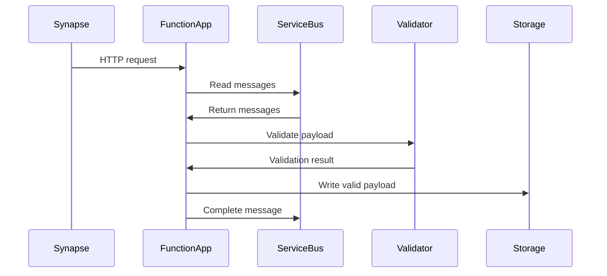
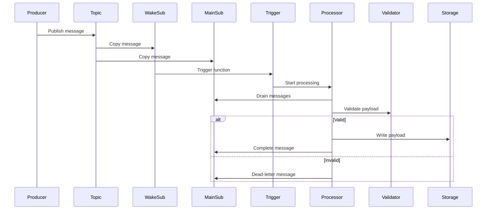

# Azure Function App documentation for Service Bus ingestion and HTTP APIs

[High level architecture](#high-level-architecture)  
[Functions folder structure](#functions-folder-structure)  
[How it works](#how-it-works)  
[HTTP Pull pattern](#http-pull-pattern)  
[Wake & Drain pattern](#wake--drain-pattern)  
[Entity configuration](#entity-configuration)  
[Validation and schemas](#validation-and-schemas)  
[Dependencies](#dependencies)  
[Developer change guide](#developer-change-guide)  
[User accessible APIs](#user-accessible-apis)

---

# High level architecture

The ODW Azure Function App has two responsibilities.

### 1. Service Bus ingestion

- Read messages from Azure Service Bus subscriptions
- Validate payloads using JSON schemas from the `data-model` repository
- Write valid payloads to the ODW RAW storage layer

### 2. HTTP APIs

- Expose selected curated data through HTTP endpoints
- Current APIs include:
  - `getDaRT`
  - `gettimesheets`
  - `testFunction`

The ingestion currently supports two patterns:

- **HTTP Pull**
- **Wake & Drain (Service Bus Trigger)**

---

# Functions folder structure

Source code location:

`functions/`

```
functions/
    .funcignore
    config.yaml
    deploy.sh
    entity_registry.py
    function_app.py
    host.json
    local.settings.json
    requirements.txt
    sb_wake_drain_processor.py
    servicebus_funcs.py
    set_environment.py
    validate_messages.py
    var_funcs.py
```

### Main files

| File | Purpose |
|---|---|
| `config.yaml` | Environment settings and entity definitions |
| `entity_registry.py` | Central registry building runtime entity definitions |
| `function_app.py` | Entry point registering all Azure Functions |
| `servicebus_funcs.py` | Shared logic for HTTP pull ingestion |
| `sb_wake_drain_processor.py` | Wake & Drain processing implementation |
| `validate_messages.py` | JSON schema validation |
| `set_environment.py` | Loads configuration values |
| `var_funcs.py` | Shared helpers such as credentials |

---

# How it works

The Function App uses the **Azure Functions Python decorator model**.

`function_app.py` performs three main tasks:

1. Load configuration and schemas
2. Register HTTP pull ingestion functions
3. Register Wake & Drain triggers for selected entities

The Function App is intentionally kept **thin**, with business logic implemented in shared modules.

### Runtime setup

Example startup configuration:

```
_STORAGE = os.environ["MESSAGE_STORAGE_ACCOUNT"]
_CONTAINER = os.environ["MESSAGE_STORAGE_CONTAINER"]

_SCHEMAS = load_schemas.load_all_schemas()["schemas"]

_app = func.FunctionApp()
_WAKE_DRAIN_ENABLED_ENTITY_KEYS = {"appeal-document"}
```

---

# HTTP Pull pattern

The HTTP Pull pattern is typically used when ingestion is triggered by **Synapse pipelines**.

### Flow

1. Synapse calls the Function endpoint
2. The Function reads from the entity's main Service Bus subscription
3. Messages are validated
4. Valid messages are written to RAW storage
5. Successfully written messages are completed in Service Bus



---

# Wake & Drain pattern

Wake & Drain separates **triggering** from **processing**.

### Topology example

Main processing subscription:

```
appeal-document-odw-sub
```

Wake subscription:

```
appeal-document-odw-wake-sub
```

### Key principle

The **wake subscription only triggers the Function App**.

It does **not**:

- process the real payload
- validate the payload
- write to storage
- dead-letter the business message

All real processing happens on the **main subscription**.

### Flow

1. Producer sends message to topic
2. Service Bus copies message to both subscriptions
3. Wake subscription triggers the Function
4. The Function drains the main subscription
5. Messages are validated and written to storage



### Processor responsibilities

The `sb_wake_drain_processor.py` module:

- opens a receiver on the main subscription
- drains messages in batches
- validates each message
- explicitly dead-letters invalid messages
- writes valid messages to storage
- completes valid messages only after successful storage

### Example DLQ reasons

- `BodyReadFailed`
- `InvalidJson`
- `SchemaValidationFailed`

---

# Entity configuration

Entities are defined centrally in `config.yaml`.

Example structure:

```
global:
  max_message_count: 100000
  max_wait_time: 5

  entities:
    nsip-document:
      topic: "nsip-document"
      subscription: "odw-nsip-document-sub"

    service-user:
      topic: "service-user"
      subscription: "odw-service-user-sub"

    appeal-document:
      topic: "appeal-document"
      subscription: "appeal-document-odw-sub"
```

---

# Entity registry

`entity_registry.py` builds runtime entity definitions.

Example structure:

```
@dataclass(frozen=True)
class EntitySpec:
    key: str
    topic: str
    subscription: str
    schema_filename: str
    sb_connection: str
    http_namespace_env_var: str
    storage_entity_override: Optional[str] = None
    http_route: Optional[str] = None
    wake_subscription: Optional[str] = None
```

The registry centralises:

- schema overrides
- HTTP route naming
- storage folder naming
- namespace configuration
- wake subscription configuration

---

# Validation and schemas

Schemas are sourced from the **data-model repository**.

Links:

- JSON schemas  
https://github.com/Planning-Inspectorate/data-model/tree/main/schemas

- Pydantic models  
https://github.com/Planning-Inspectorate/data-model/tree/main/pins_data_model/models

Validation is implemented using `jsonschema`.

### Behaviour

- Valid message → empty error list
- Invalid message → list of validation errors

Validation also includes **ISO-8601 date-time checking**.

---

# Dependencies

Main dependencies include:

```
azure-functions
azure-servicebus
azure-storage-blob
azure-identity
jsonschema
iso8601
PyYAML
pins_data_model
```

Schemas are loaded from the shared repository:

```
from pins_data_model import load_schemas
```

---

# Developer change guide

### Add a new entity

1. Add the entity to `config.yaml`
2. Confirm schema mapping in `entity_registry.py`
3. Deploy the Function App
4. Test the generated route

### Enable Wake & Drain

1. Create the wake subscription in Service Bus
2. Add the mapping in `entity_registry.py`
3. Add the entity to `_WAKE_DRAIN_ENABLED_ENTITY_KEYS`
4. Deploy the Function App
5. Validate trigger and processing behaviour

### Remove an entity

1. Remove from `config.yaml`
2. Remove special handling in `entity_registry.py`
3. Remove from `_WAKE_DRAIN_ENABLED_ENTITY_KEYS`
4. Deploy the Function App

---

# User accessible APIs

The Function App also exposes SQL-backed APIs.

### getDaRT

Endpoint:

```
/api/getDaRT
```

Returns records from curated `dart_api` table using:

- `applicationReference`
- `caseReference`

---

### gettimesheets

Endpoint:

```
/api/gettimesheets
```

Wildcard search across fields in `appeal_has`.

Searchable fields include:

- caseReference
- applicationReference
- siteAddressLine1
- siteAddressTown
- siteAddressCounty
- siteAddressPostcode

---

### testFunction

Endpoint:

```
/api/testFunction
```

Diagnostic endpoint returning records from the logging database.

---

# Notes

This document focuses on the **technical architecture and behaviour of the Function App**.

Operational topics such as:

- deployment
- RBAC
- networking
- troubleshooting
- Terraform
- Key Vault

are documented separately in operational documentation (Confluence).